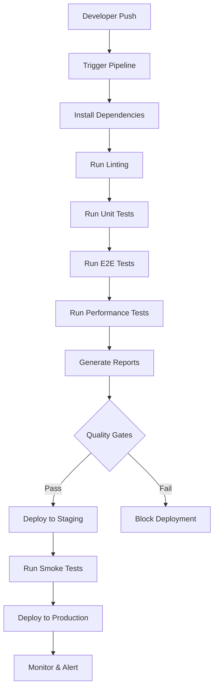

# Lesson 7.6: Integrating CI/CD and Reporting

## Learning Objectives

By the end of this lesson, you will be able to:

- **Set up comprehensive CI/CD pipelines** using GitHub Actions for automated testing
- **Implement quality gates** that prevent deployment of failing tests
- **Configure multi-environment deployments** with automated test execution
- **Generate comprehensive test reports** with actionable insights
- **Set up monitoring and alerting** for test failures and performance regressions
- **Integrate test results** with project management and communication tools
- **Implement deployment strategies** that prioritize quality and reliability
- **Create dashboards** for test metrics and project health monitoring

## Prerequisites

- Completed Lesson 7.5 (Implementing Advanced Test Scenarios)
- Understanding of Git workflows and branching strategies
- Basic knowledge of YAML configuration files
- Familiarity with environment variables and secrets management

## Estimated Duration

**4-5 hours** (including pipeline setup and configuration)

---

## Introduction

CI/CD integration transforms your test automation from a development tool into a critical part of your deployment pipeline. In this lesson, you'll implement enterprise-grade CI/CD workflows that ensure code quality, automate deployments, and provide comprehensive visibility into your application's health.

Professional QA engineers must understand how to integrate testing into the broader software delivery lifecycle, making quality assurance a continuous process rather than a final checkpoint.

---

## Section 1: CI/CD Pipeline Architecture

### Understanding the CI/CD Flow



### 1.1 GitHub Actions Workflow Structure

Create the main CI/CD workflow:

```yaml
# .github/workflows/ci-cd.yml
name: CI/CD Pipeline

on:
  push:
    branches: [ main, develop ]
  pull_request:
    branches: [ main ]
  schedule:
    - cron: '0 2 * * *'  # Daily at 2 AM

env:
  NODE_VERSION: '18'
  PLAYWRIGHT_VERSION: '1.40.0'

jobs:
  setup:
    runs-on: ubuntu-latest
    outputs:
      cache-key: ${{ steps.cache-key.outputs.key }}
    steps:
      - uses: actions/checkout@v4
      
      - name: Setup Node.js
        uses: actions/setup-node@v4
        with:
          node-version: ${{ env.NODE_VERSION }}
          cache: 'npm'
      
      - name: Generate cache key
        id: cache-key
        run: echo "key=node-modules-${{ hashFiles('**/package-lock.json') }}" >> $GITHUB_OUTPUT
      
      - name: Cache dependencies
        uses: actions/cache@v3
        with:
          path: |
            node_modules
            ~/.cache/ms-playwright
          key: ${{ steps.cache-key.outputs.key }}
          restore-keys: |
            node-modules-
      
      - name: Install dependencies
        run: npm ci
      
      - name: Install Playwright browsers
        run: npx playwright install --with-deps

  lint-and-typecheck:
    needs: setup
    runs-on: ubuntu-latest
    steps:
      - uses: actions/checkout@v4
      
      - name: Setup Node.js
        uses: actions/setup-node@v4
        with:
          node-version: ${{ env.NODE_VERSION }}
          cache: 'npm'
      
      - name: Restore dependencies
        uses: actions/cache@v3
        with:
          path: |
            node_modules
            ~/.cache/ms-playwright
          key: ${{ needs.setup.outputs.cache-key }}
      
      - name: Run ESLint
        run: npm run lint
      
      - name: Run TypeScript check
        run: npm run typecheck
      
      - name: Upload lint results
        if: always()
        uses: actions/upload-artifact@v4
        with:
          name: lint-results
          path: |
            eslint-report.json
            tsc-report.json

  unit-tests:
    needs: setup
    runs-on: ubuntu-latest
    steps:
      - uses: actions/checkout@v4
      
      - name: Setup Node.js
        uses: actions/setup-node@v4
        with:
          node-version: ${{ env.NODE_VERSION }}
          cache: 'npm'
      
      - name: Restore dependencies
        uses: actions/cache@v3
        with:
          path: |
            node_modules
            ~/.cache/ms-playwright
          key: ${{ needs.setup.outputs.cache-key }}
      
      - name: Run unit tests
        run: npm run test:unit -- --coverage
      
      - name: Upload coverage reports
        uses: codecov/codecov-action@v3
        with:
          files: ./coverage/lcov.info
          flags: unit-tests
      
      - name: Upload test results
        if: always()
        uses: actions/upload-artifact@v4
        with:
          name: unit-test-results
          path: |
            coverage/
            junit.xml

  e2e-tests:
    needs: setup
    runs-on: ubuntu-latest
    strategy:
      fail-fast: false
      matrix:
        browser: [chromium, firefox, webkit]
        shard: [1, 2, 3, 4]
    steps:
      - uses: actions/checkout@v4
      
      - name: Setup Node.js
        uses: actions/setup-node@v4
        with:
          node-version: ${{ env.NODE_VERSION }}
          cache: 'npm'
      
      - name: Restore dependencies
        uses: actions/cache@v3
        with:
          path: |
            node_modules
            ~/.cache/ms-playwright
          key: ${{ needs.setup.outputs.cache-key }}
      
      - name: Run E2E tests
        run: npx playwright test --project=${{ matrix.browser }} --shard=${{ matrix.shard }}/4
        env:
          BASE_URL: ${{ secrets.STAGING_URL }}
          CI: true
      
      - name: Upload test results
        if: always()
        uses: actions/upload-artifact@v4
        with:
          name: e2e-results-${{ matrix.browser }}-${{ matrix.shard }}
          path: |
            test-results/
            playwright-report/
      
      - name: Upload screenshots on failure
        if: failure()
        uses: actions/upload-artifact@v4
        with:
          name: screenshots-${{ matrix.browser }}-${{ matrix.shard }}
          path: test-results/

  performance-tests:
    needs: setup
    runs-on: ubuntu-latest
    steps:
      - uses: actions/checkout@v4
      
      - name: Setup Node.js
        uses: actions/setup-node@v4
        with:
          node-version: ${{ env.NODE_VERSION }}
          cache: 'npm'
      
      - name: Restore dependencies
        uses: actions/cache@v3
        with:
          path: |
            node_modules
            ~/.cache/ms-playwright
          key: ${{ needs.setup.outputs.cache-key }}
      
      - name: Run performance tests
        run: npm run test:performance
        env:
          BASE_URL: ${{ secrets.STAGING_URL }}
      
      - name: Upload performance results
        if: always()
        uses: actions/upload-artifact@v4
        with:
          name: performance-results
          path: performance-results/

  quality-gate:
    needs: [lint-and-typecheck, unit-tests, e2e-tests, performance-tests]
    runs-on: ubuntu-latest
    if: always()
    steps:
      - name: Check quality gate
        run: |
          if [[ "${{ needs.lint-and-typecheck.result }}" != "success" ]]; then
            echo "❌ Linting or type checking failed"
            exit 1
          fi
          
          if [[ "${{ needs.unit-tests.result }}" != "success" ]]; then
            echo "❌ Unit tests failed"
            exit 1
          fi
          
          if [[ "${{ needs.e2e-tests.result }}" != "success" ]]; then
            echo "❌ E2E tests failed"
            exit 1
          fi
          
          if [[ "${{ needs.performance-tests.result }}" != "success" ]]; then
            echo "❌ Performance tests failed"
            exit 1
          fi
          
          echo "✅ All quality gates passed"

  deploy-staging:
    needs: quality-gate
    runs-on: ubuntu-latest
    if: github.ref == 'refs/heads/develop'
    environment: staging
    steps:
      - uses: actions/checkout@v4
      
      - name: Deploy to staging
        run: |
          echo "🚀 Deploying to staging environment"
          # Add your deployment commands here
        env:
          STAGING_URL: ${{ secrets.STAGING_URL }}
          DEPLOY_KEY: ${{ secrets.STAGING_DEPLOY_KEY }}

  deploy-production:
    needs: quality-gate
    runs-on: ubuntu-latest
    if: github.ref == 'refs/heads/main'
    environment: production
    steps:
      - uses: actions/checkout@v4
      
      - name: Deploy to production
        run: |
          echo "🚀 Deploying to production environment"
          # Add your deployment commands here
        env:
          PRODUCTION_URL: ${{ secrets.PRODUCTION_URL }}
          DEPLOY_KEY: ${{ secrets.PRODUCTION_DEPLOY_KEY }}

  smoke-tests:
    needs: [deploy-staging, deploy-production]
    runs-on: ubuntu-latest
    if: always() && (needs.deploy-staging.result == 'success' || needs.deploy-production.result == 'success')
    steps:
      - uses: actions/checkout@v4
      
      - name: Setup Node.js
        uses: actions/setup-node@v4
        with:
          node-version: ${{ env.NODE_VERSION }}
          cache: 'npm'
      
      - name: Install dependencies
        run: npm ci
      
      - name: Install Playwright browsers
        run: npx playwright install chromium
      
      - name: Run smoke tests
        run: npm run test:smoke
        env:
          BASE_URL: ${{ needs.deploy-production.result == 'success' && secrets.PRODUCTION_URL || secrets.STAGING_URL }}
      
      - name: Upload smoke test results
        if: always()
        uses: actions/upload-artifact@v4
        with:
          name: smoke-test-results
          path: smoke-test-results/

  notify:
    needs: [quality-gate, deploy-staging, deploy-production, smoke-tests]
    runs-on: ubuntu-latest
    if: always()
    steps:
      - name: Notify Slack
        uses: 8398a7/action-slack@v3
        with:
          status: ${{ job.status }}
          channel: '#qa-automation'
          webhook_url: ${{ secrets.SLACK_WEBHOOK }}
```

### 1.2 Environment-Specific Configuration

```yaml
# .github/workflows/staging-deployment.yml
name: Staging Deployment

on:
  push:
    branches: [ develop ]

jobs:
  deploy-and-test:
    runs-on: ubuntu-latest
    environment: staging
    steps:
      - uses: actions/checkout@v4
      
      - name: Deploy to staging
        run: |
          # Deployment commands
          echo "Deploying to staging..."
        env:
          STAGING_URL: ${{ secrets.STAGING_URL }}
      
      - name: Wait for deployment
        run: |
          echo "Waiting for deployment to be ready..."
          sleep 30
      
      - name: Run comprehensive tests
        run: |
          npm ci
          npx playwright install
          npm run test:staging
        env:
          BASE_URL: ${{ secrets.STAGING_URL }}
          API_KEY: ${{ secrets.STAGING_API_KEY }}
```

---

## Section 2: Advanced Reporting and Dashboards

### 2.1 Enhanced Test Reporting

Create a comprehensive test reporter:

```typescript
// src/utils/TestReporter.ts
import { Reporter, TestCase, TestResult, FullResult } from '@playwright/test/reporter';
import * as fs from 'fs';
import * as path from 'path';

interface TestMetrics {
  total: number;
  passed: number;
  failed: number;
  skipped: number;
  flaky: number;
  duration: number;
  browserBreakdown: Record<string, { passed: number; failed: number; }>;
}

export class ComprehensiveReporter implements Reporter {
  private startTime: number = 0;
  private results: TestResult[] = [];
  private metrics: TestMetrics = {
    total: 0,
    passed: 0,
    failed: 0,
    skipped: 0,
    flaky: 0,
    duration: 0,
    browserBreakdown: {}
  };

  onBegin(config: any, suite: any) {
    this.startTime = Date.now();
    console.log(`🚀 Starting test execution with ${suite.allTests().length} tests`);
  }

  onTestEnd(test: TestCase, result: TestResult) {
    this.results.push(result);
    this.updateMetrics(test, result);
  }

  onEnd(result: FullResult) {
    this.metrics.duration = Date.now() - this.startTime;
    this.generateReports();
    this.generateSummary();
  }

  private updateMetrics(test: TestCase, result: TestResult) {
    this.metrics.total++;
    
    switch (result.status) {
      case 'passed':
        this.metrics.passed++;
        break;
      case 'failed':
        this.metrics.failed++;
        break;
      case 'skipped':
        this.metrics.skipped++;
        break;
      case 'timedOut':
        this.metrics.failed++;
        break;
    }

    if (result.retry > 0 && result.status === 'passed') {
      this.metrics.flaky++;
    }

    // Browser breakdown
    const project = test.parent.project()?.name || 'unknown';
    if (!this.metrics.browserBreakdown[project]) {
      this.metrics.browserBreakdown[project] = { passed: 0, failed: 0 };
    }
    
    if (result.status === 'passed') {
      this.metrics.browserBreakdown[project].passed++;
    } else if (result.status === 'failed') {
      this.metrics.browserBreakdown[project].failed++;
    }
  }

  private generateReports() {
    this.generateJsonReport();
    this.generateHtmlReport();
    this.generateJunitReport();
    this.generateSlackReport();
  }

  private generateJsonReport() {
    const report = {
      timestamp: new Date().toISOString(),
      metrics: this.metrics,
      results: this.results.map(result => ({
        title: result.test.title,
        status: result.status,
        duration: result.duration,
        error: result.error?.message,
        retry: result.retry
      }))
    };

    fs.writeFileSync('test-results/detailed-report.json', JSON.stringify(report, null, 2));
  }

  private generateHtmlReport() {
    const html = `
<!DOCTYPE html>
<html>
<head>
    <title>Test Execution Report</title>
    <style>
        body { font-family: Arial, sans-serif; margin: 20px; }
        .summary { background: #f5f5f5; padding: 20px; border-radius: 5px; margin-bottom: 20px; }
        .metric { display: inline-block; margin: 10px 20px; }
        .passed { color: #28a745; }
        .failed { color: #dc3545; }
        .flaky { color: #ffc107; }
        table { width: 100%; border-collapse: collapse; }
        th, td { border: 1px solid #ddd; padding: 8px; text-align: left; }
        th { background-color: #f2f2f2; }
    </style>
</head>
<body>
    <h1>Test Execution Report</h1>
    <div class="summary">
        <h2>Summary</h2>
        <div class="metric">Total: ${this.metrics.total}</div>
        <div class="metric passed">Passed: ${this.metrics.passed}</div>
        <div class="metric failed">Failed: ${this.metrics.failed}</div>
        <div class="metric">Skipped: ${this.metrics.skipped}</div>
        <div class="metric flaky">Flaky: ${this.metrics.flaky}</div>
        <div class="metric">Duration: ${(this.metrics.duration / 1000).toFixed(2)}s</div>
    </div>
    
    <h2>Browser Breakdown</h2>
    <table>
        <tr><th>Browser</th><th>Passed</th><th>Failed</th><th>Success Rate</th></tr>
        ${Object.entries(this.metrics.browserBreakdown).map(([browser, stats]) => {
          const total = stats.passed + stats.failed;
          const successRate = total > 0 ? ((stats.passed / total) * 100).toFixed(1) : '0';
          return `<tr>
            <td>${browser}</td>
            <td class="passed">${stats.passed}</td>
            <td class="failed">${stats.failed}</td>
            <td>${successRate}%</td>
          </tr>`;
        }).join('')}
    </table>
    
    <p>Generated at: ${new Date().toISOString()}</p>
</body>
</html>`;

    fs.writeFileSync('test-results/report.html', html);
  }

  private generateJunitReport() {
    const testcases = this.results.map(result => {
      const testcase = `<testcase name="${result.test.title}" time="${result.duration / 1000}">`;
      if (result.status === 'failed') {
        return `${testcase}<failure message="${result.error?.message || 'Test failed'}" /></testcase>`;
      } else if (result.status === 'skipped') {
        return `${testcase}<skipped /></testcase>`;
      }
      return `${testcase}</testcase>`;
    }).join('\n');

    const junit = `<?xml version="1.0" encoding="UTF-8"?>
<testsuite name="E2E Tests" tests="${this.metrics.total}" failures="${this.metrics.failed}" time="${this.metrics.duration / 1000}">
${testcases}
</testsuite>`;

    fs.writeFileSync('test-results/junit.xml', junit);
  }

  private generateSlackReport() {
    const successRate = this.metrics.total > 0 ? ((this.metrics.passed / this.metrics.total) * 100).toFixed(1) : '0';
    const emoji = this.metrics.failed === 0 ? '✅' : '❌';
    
    const slackMessage = {
      text: `${emoji} Test Execution Complete`,
      blocks: [
        {
          type: 'section',
          text: {
            type: 'mrkdwn',
            text: `*Test Execution Summary*\n• Total: ${this.metrics.total}\n• Passed: ${this.metrics.passed}\n• Failed: ${this.metrics.failed}\n• Success Rate: ${successRate}%\n• Duration: ${(this.metrics.duration / 1000).toFixed(2)}s`
          }
        }
      ]
    };

    fs.writeFileSync('test-results/slack-message.json', JSON.stringify(slackMessage, null, 2));
  }

  private generateSummary() {
    const successRate = this.metrics.total > 0 ? ((this.metrics.passed / this.metrics.total) * 100).toFixed(1) : '0';
    
    console.log('\n📊 Test Execution Summary');
    console.log('━━━━━━━━━━━━━━━━━━━━━━━━━');
    console.log(`Total Tests: ${this.metrics.total}`);
    console.log(`✅ Passed: ${this.metrics.passed}`);
    console.log(`❌ Failed: ${this.metrics.failed}`);
    console.log(`⏭️  Skipped: ${this.metrics.skipped}`);
    console.log(`🔄 Flaky: ${this.metrics.flaky}`);
    console.log(`📈 Success Rate: ${successRate}%`);
    console.log(`⏱️  Duration: ${(this.metrics.duration / 1000).toFixed(2)}s`);
    console.log('━━━━━━━━━━━━━━━━━━━━━━━━━\n');
  }
}
```

### 2.2 Real-time Dashboard Integration

```typescript
// src/utils/DashboardIntegration.ts
import axios from 'axios';

export class DashboardIntegration {
  private dashboardUrl: string;
  private apiKey: string;

  constructor(dashboardUrl: string, apiKey: string) {
    this.dashboardUrl = dashboardUrl;
    this.apiKey = apiKey;
  }

  async sendMetrics(metrics: any): Promise<void> {
    try {
      await axios.post(`${this.dashboardUrl}/api/metrics`, {
        ...metrics,
        timestamp: new Date().toISOString(),
        environment: process.env.NODE_ENV || 'development',
        branch: process.env.GITHUB_REF_NAME || 'unknown'
      }, {
        headers: {
          'Authorization': `Bearer ${this.apiKey}`,
          'Content-Type': 'application/json'
        }
      });
      
      console.log('✅ Metrics sent to dashboard');
    } catch (error) {
      console.error('❌ Failed to send metrics to dashboard:', error);
    }
  }

  async sendAlert(alert: {
    type: 'failure' | 'performance' | 'flaky';
    message: string;
    severity: 'low' | 'medium' | 'high';
    metadata?: any;
  }): Promise<void> {
    try {
      await axios.post(`${this.dashboardUrl}/api/alerts`, alert, {
        headers: {
          'Authorization': `Bearer ${this.apiKey}`,
          'Content-Type': 'application/json'
        }
      });
      
      console.log('🚨 Alert sent to dashboard');
    } catch (error) {
      console.error('❌ Failed to send alert to dashboard:', error);
    }
  }
}
```

---

## Section 3: Quality Gates and Deployment Strategies

### 3.1 Custom Quality Gate Implementation

```typescript
// src/utils/QualityGate.ts
interface QualityGateConfig {
  minSuccessRate: number;
  maxFailedTests: number;
  maxDuration: number;
  maxFlakyTests: number;
  requiredBrowsers: string[];
}

export class QualityGate {
  private config: QualityGateConfig;

  constructor(config: QualityGateConfig) {
    this.config = config;
  }

  evaluate(metrics: any): { passed: boolean; violations: string[] } {
    const violations: string[] = [];

    // Check success rate
    const successRate = (metrics.passed / metrics.total) * 100;
    if (successRate < this.config.minSuccessRate) {
      violations.push(`Success rate ${successRate.toFixed(1)}% below threshold ${this.config.minSuccessRate}%`);
    }

    // Check failed test count
    if (metrics.failed > this.config.maxFailedTests) {
      violations.push(`Failed tests ${metrics.failed} exceeds maximum ${this.config.maxFailedTests}`);
    }

    // Check execution duration
    if (metrics.duration > this.config.maxDuration) {
      violations.push(`Execution time ${metrics.duration}ms exceeds maximum ${this.config.maxDuration}ms`);
    }

    // Check flaky tests
    if (metrics.flaky > this.config.maxFlakyTests) {
      violations.push(`Flaky tests ${metrics.flaky} exceeds maximum ${this.config.maxFlakyTests}`);
    }

    // Check browser coverage
    const testedBrowsers = Object.keys(metrics.browserBreakdown);
    const missingBrowsers = this.config.requiredBrowsers.filter(
      browser => !testedBrowsers.includes(browser)
    );
    if (missingBrowsers.length > 0) {
      violations.push(`Missing browser coverage: ${missingBrowsers.join(', ')}`);
    }

    return {
      passed: violations.length === 0,
      violations
    };
  }

  generateReport(evaluation: { passed: boolean; violations: string[] }): string {
    if (evaluation.passed) {
      return '✅ Quality gate PASSED - Ready for deployment';
    }

    const report = [
      '❌ Quality gate FAILED - Deployment blocked',
      '',
      'Violations:',
      ...evaluation.violations.map(v => `  • ${v}`),
      '',
      'Please fix these issues before proceeding with deployment.'
    ];

    return report.join('\n');
  }
}
```

### 3.2 Deployment Strategy Configuration

```yaml
# .github/workflows/deployment-strategy.yml
name: Advanced Deployment Strategy

on:
  push:
    branches: [ main ]

jobs:
  quality-check:
    runs-on: ubuntu-latest
    outputs:
      deploy-approved: ${{ steps.quality-gate.outputs.approved }}
    steps:
      - uses: actions/checkout@v4
      - name: Run quality gate
        id: quality-gate
        run: |
          # Run comprehensive test suite
          npm run test:all
          
          # Evaluate quality gate
          if npm run quality:gate; then
            echo "approved=true" >> $GITHUB_OUTPUT
          else
            echo "approved=false" >> $GITHUB_OUTPUT
          fi

  blue-green-deployment:
    needs: quality-check
    if: needs.quality-check.outputs.deploy-approved == 'true'
    runs-on: ubuntu-latest
    steps:
      - name: Deploy to blue environment
        run: |
          echo "🔵 Deploying to blue environment"
          # Deploy to blue environment
      
      - name: Run smoke tests on blue
        run: |
          npm run test:smoke -- --env=blue
      
      - name: Switch traffic to blue
        run: |
          echo "🔄 Switching traffic to blue environment"
          # Switch load balancer to blue
      
      - name: Monitor blue environment
        run: |
          echo "📊 Monitoring blue environment for 5 minutes"
          sleep 300
      
      - name: Verify deployment success
        run: |
          npm run test:health-check -- --env=blue

  rollback-on-failure:
    needs: [quality-check, blue-green-deployment]
    if: failure()
    runs-on: ubuntu-latest
    steps:
      - name: Rollback deployment
        run: |
          echo "🔴 Rolling back deployment"
          # Rollback to previous version
      
      - name: Notify team
        uses: 8398a7/action-slack@v3
        with:
          status: failure
          custom_payload: |
            {
              "text": "🚨 Deployment failed and was rolled back",
              "attachments": [{
                "color": "danger",
                "fields": [{
                  "title": "Branch",
                  "value": "${{ github.ref }}",
                  "short": true
                }, {
                  "title": "Commit",
                  "value": "${{ github.sha }}",
                  "short": true
                }]
              }]
            }
```

---

## Section 4: Monitoring and Alerting

### 4.1 Test Monitoring Setup

```typescript
// src/utils/TestMonitor.ts
import { EventEmitter } from 'events';

export class TestMonitor extends EventEmitter {
  private metrics: Map<string, any> = new Map();
  private thresholds: Map<string, number> = new Map();

  constructor() {
    super();
    this.setupThresholds();
  }

  private setupThresholds() {
    this.thresholds.set('failure_rate', 10); // Max 10% failure rate
    this.thresholds.set('avg_duration', 300000); // Max 5 minutes average
    this.thresholds.set('flaky_rate', 5); // Max 5% flaky rate
  }

  recordTestResult(testName: string, result: {
    status: string;
    duration: number;
    retry: number;
  }) {
    const key = `test_${testName}`;
    if (!this.metrics.has(key)) {
      this.metrics.set(key, { total: 0, failed: 0, totalDuration: 0, flaky: 0 });
    }

    const metric = this.metrics.get(key);
    metric.total++;
    metric.totalDuration += result.duration;

    if (result.status === 'failed') {
      metric.failed++;
    }

    if (result.retry > 0 && result.status === 'passed') {
      metric.flaky++;
    }

    this.checkThresholds(testName, metric);
  }

  private checkThresholds(testName: string, metric: any) {
    const failureRate = (metric.failed / metric.total) * 100;
    const avgDuration = metric.totalDuration / metric.total;
    const flakyRate = (metric.flaky / metric.total) * 100;

    if (failureRate > this.thresholds.get('failure_rate')!) {
      this.emit('threshold_exceeded', {
        test: testName,
        metric: 'failure_rate',
        value: failureRate,
        threshold: this.thresholds.get('failure_rate')
      });
    }

    if (avgDuration > this.thresholds.get('avg_duration')!) {
      this.emit('threshold_exceeded', {
        test: testName,
        metric: 'avg_duration',
        value: avgDuration,
        threshold: this.thresholds.get('avg_duration')
      });
    }

    if (flakyRate > this.thresholds.get('flaky_rate')!) {
      this.emit('threshold_exceeded', {
        test: testName,
        metric: 'flaky_rate',
        value: flakyRate,
        threshold: this.thresholds.get('flaky_rate')
      });
    }
  }

  generateHealthReport(): any {
    const report = {
      timestamp: new Date().toISOString(),
      tests: Array.from(this.metrics.entries()).map(([testName, metric]) => ({
        name: testName.replace('test_', ''),
        total: metric.total,
        failed: metric.failed,
        flaky: metric.flaky,
        failureRate: (metric.failed / metric.total) * 100,
        avgDuration: metric.totalDuration / metric.total,
        flakyRate: (metric.flaky / metric.total) * 100
      }))
    };

    return report;
  }
}
```

### 4.2 Alerting Integration

```typescript
// src/utils/AlertManager.ts
interface Alert {
  level: 'info' | 'warning' | 'critical';
  message: string;
  details?: any;
  timestamp: string;
}

export class AlertManager {
  private webhooks: Map<string, string> = new Map();

  constructor() {
    this.webhooks.set('slack', process.env.SLACK_WEBHOOK || '');
    this.webhooks.set('teams', process.env.TEAMS_WEBHOOK || '');
    this.webhooks.set('email', process.env.EMAIL_WEBHOOK || '');
  }

  async sendAlert(alert: Alert): Promise<void> {
    console.log(`🚨 Alert: ${alert.level.toUpperCase()} - ${alert.message}`);

    // Send to Slack
    if (this.webhooks.get('slack')) {
      await this.sendSlackAlert(alert);
    }

    // Send to Teams
    if (this.webhooks.get('teams')) {
      await this.sendTeamsAlert(alert);
    }

    // Log to file
    this.logAlert(alert);
  }

  private async sendSlackAlert(alert: Alert): Promise<void> {
    const color = {
      info: '#36a64f',
      warning: '#ffb84d',
      critical: '#ff4444'
    }[alert.level];

    const payload = {
      attachments: [{
        color,
        title: `${alert.level.toUpperCase()} Alert`,
        text: alert.message,
        fields: alert.details ? Object.entries(alert.details).map(([key, value]) => ({
          title: key,
          value: String(value),
          short: true
        })) : [],
        timestamp: Math.floor(Date.now() / 1000)
      }]
    };

    try {
      const response = await fetch(this.webhooks.get('slack')!, {
        method: 'POST',
        headers: { 'Content-Type': 'application/json' },
        body: JSON.stringify(payload)
      });

      if (!response.ok) {
        throw new Error(`Slack webhook failed: ${response.statusText}`);
      }
    } catch (error) {
      console.error('Failed to send Slack alert:', error);
    }
  }

  private async sendTeamsAlert(alert: Alert): Promise<void> {
    const payload = {
      '@type': 'MessageCard',
      '@context': 'https://schema.org/extensions',
      summary: alert.message,
      themeColor: {
        info: '00FF00',
        warning: 'FFFF00',
        critical: 'FF0000'
      }[alert.level],
      sections: [{
        activityTitle: `${alert.level.toUpperCase()} Alert`,
        activitySubtitle: alert.message,
        facts: alert.details ? Object.entries(alert.details).map(([key, value]) => ({
          name: key,
          value: String(value)
        })) : []
      }]
    };

    try {
      const response = await fetch(this.webhooks.get('teams')!, {
        method: 'POST',
        headers: { 'Content-Type': 'application/json' },
        body: JSON.stringify(payload)
      });

      if (!response.ok) {
        throw new Error(`Teams webhook failed: ${response.statusText}`);
      }
    } catch (error) {
      console.error('Failed to send Teams alert:', error);
    }
  }

  private logAlert(alert: Alert): void {
    const logEntry = `${alert.timestamp} [${alert.level.toUpperCase()}] ${alert.message}\n`;
    require('fs').appendFileSync('.logs/alerts.log', logEntry);
  }
}
```

---

## Section 5: Integration with Project Management Tools

### 5.1 Jira Integration

```typescript
// src/utils/JiraIntegration.ts
import axios from 'axios';

export class JiraIntegration {
  private baseUrl: string;
  private auth: string;

  constructor(baseUrl: string, email: string, apiToken: string) {
    this.baseUrl = baseUrl;
    this.auth = Buffer.from(`${email}:${apiToken}`).toString('base64');
  }

  async createBugTicket(testFailure: {
    testName: string;
    error: string;
    screenshot?: string;
    environment: string;
  }): Promise<string> {
    const issueData = {
      fields: {
        project: { key: 'QA' },
        summary: `Test Failure: ${testFailure.testName}`,
        description: {
          type: 'doc',
          version: 1,
          content: [{
            type: 'paragraph',
            content: [{
              type: 'text',
              text: `Automated test failure detected:\n\nTest: ${testFailure.testName}\nEnvironment: ${testFailure.environment}\nError: ${testFailure.error}`
            }]
          }]
        },
        issuetype: { name: 'Bug' },
        priority: { name: 'High' },
        labels: ['automated-test', 'ci-cd']
      }
    };

    try {
      const response = await axios.post(`${this.baseUrl}/rest/api/3/issue`, issueData, {
        headers: {
          'Authorization': `Basic ${this.auth}`,
          'Content-Type': 'application/json'
        }
      });

      return response.data.key;
    } catch (error) {
      console.error('Failed to create Jira ticket:', error);
      throw error;
    }
  }

  async updateTestExecutionStatus(executionId: string, status: 'PASS' | 'FAIL', results: any): Promise<void> {
    const updateData = {
      status,
      executedOn: new Date().toISOString(),
      results: results
    };

    try {
      await axios.put(`${this.baseUrl}/rest/api/3/testexecution/${executionId}`, updateData, {
        headers: {
          'Authorization': `Basic ${this.auth}`,
          'Content-Type': 'application/json'
        }
      });
    } catch (error) {
      console.error('Failed to update Jira test execution:', error);
    }
  }
}
```

---

## Section 6: Performance and Cost Optimization

### 6.1 CI/CD Optimization Strategies

```yaml
# .github/workflows/optimized-ci.yml
name: Optimized CI Pipeline

on:
  push:
    branches: [ main, develop ]
  pull_request:
    branches: [ main ]

jobs:
  changes:
    runs-on: ubuntu-latest
    outputs:
      tests: ${{ steps.changes.outputs.tests }}
      src: ${{ steps.changes.outputs.src }}
    steps:
      - uses: actions/checkout@v4
      - uses: dorny/paths-filter@v2
        id: changes
        with:
          filters: |
            tests:
              - 'tests/**'
              - 'src/**'
            src:
              - 'src/**'
              - 'package.json'

  smart-testing:
    needs: changes
    if: needs.changes.outputs.tests == 'true'
    runs-on: ubuntu-latest
    strategy:
      matrix:
        # Only run on essential browsers for PR, full matrix for main
        browser: ${{ github.event_name == 'pull_request' && fromJSON('["chromium"]') || fromJSON('["chromium", "firefox", "webkit"]') }}
    steps:
      - uses: actions/checkout@v4
        with:
          fetch-depth: 0
      
      - name: Get changed files
        id: changed-files
        run: |
          echo "files=$(git diff --name-only ${{ github.event.before }}..${{ github.sha }} | grep -E '\.(ts|js)$' | tr '\n' ' ')" >> $GITHUB_OUTPUT
      
      - name: Run affected tests only
        run: |
          # Run only tests affected by changed files
          npm run test:affected -- --files="${{ steps.changed-files.outputs.files }}"
```

### 6.2 Cost Monitoring and Optimization

```typescript
// src/utils/CostOptimizer.ts
export class CostOptimizer {
  private readonly MAX_PARALLEL_JOBS = 4;
  private readonly MAX_EXECUTION_TIME = 30; // minutes

  optimizeTestExecution(tests: any[]): {
    batches: any[][];
    estimatedCost: number;
    estimatedTime: number;
  } {
    // Group tests by estimated execution time
    const fastTests = tests.filter(t => t.estimatedDuration < 30000);
    const mediumTests = tests.filter(t => t.estimatedDuration >= 30000 && t.estimatedDuration < 120000);
    const slowTests = tests.filter(t => t.estimatedDuration >= 120000);

    // Create optimized batches
    const batches = this.createOptimalBatches([...slowTests, ...mediumTests, ...fastTests]);
    
    // Estimate costs (based on GitHub Actions pricing)
    const totalMinutes = this.estimateTotalExecutionTime(batches);
    const estimatedCost = totalMinutes * 0.008; // $0.008 per minute for Linux

    return {
      batches,
      estimatedCost,
      estimatedTime: totalMinutes
    };
  }

  private createOptimalBatches(tests: any[]): any[][] {
    const batches: any[][] = [];
    let currentBatch: any[] = [];
    let currentBatchTime = 0;
    const maxBatchTime = (this.MAX_EXECUTION_TIME * 60 * 1000) / this.MAX_PARALLEL_JOBS;

    for (const test of tests) {
      if (currentBatchTime + test.estimatedDuration > maxBatchTime && currentBatch.length > 0) {
        batches.push([...currentBatch]);
        currentBatch = [test];
        currentBatchTime = test.estimatedDuration;
      } else {
        currentBatch.push(test);
        currentBatchTime += test.estimatedDuration;
      }
    }

    if (currentBatch.length > 0) {
      batches.push(currentBatch);
    }

    return batches;
  }

  private estimateTotalExecutionTime(batches: any[][]): number {
    const batchTimes = batches.map(batch => 
      batch.reduce((sum, test) => sum + test.estimatedDuration, 0)
    );
    
    // Assuming parallel execution
    const parallelTime = Math.max(...batchTimes);
    return Math.ceil(parallelTime / (1000 * 60)); // Convert to minutes
  }
}
```

---

## Exercises

### Exercise 1: Complete CI/CD Pipeline Setup

Set up a comprehensive CI/CD pipeline for your project:

1. Configure GitHub Actions with multiple environments
2. Implement quality gates with custom thresholds
3. Set up automated deployment with rollback capabilities
4. Configure monitoring and alerting

### Exercise 2: Advanced Reporting Dashboard

Create a comprehensive reporting system:

1. Implement custom test reporters
2. Set up real-time dashboard integration
3. Configure automated report distribution
4. Create performance trending analysis

### Exercise 3: Integration Testing

Integrate your CI/CD pipeline with external tools:

1. Connect to Jira for bug tracking
2. Set up Slack/Teams notifications
3. Implement performance monitoring
4. Configure cost optimization strategies

### Exercise 4: Deployment Strategy Implementation

Implement advanced deployment strategies:

1. Set up blue-green deployment
2. Configure canary releases
3. Implement feature flags
4. Set up automated rollback mechanisms

---

## Advanced Concepts

### Infrastructure as Code

```yaml
# terraform/ci-cd-infrastructure.tf
resource "github_actions_environment" "staging" {
  repository  = var.repository_name
  environment = "staging"
  
  deployment_branch_policy {
    protected_branches     = false
    custom_branch_policies = true
  }
}

resource "github_actions_environment" "production" {
  repository  = var.repository_name
  environment = "production"
  
  deployment_branch_policy {
    protected_branches     = true
    custom_branch_policies = false
  }
  
  reviewers {
    teams = [data.github_team.qa_team.id]
  }
}
```

### Container-Based Testing

```dockerfile
# Dockerfile.testing
FROM mcr.microsoft.com/playwright:v1.40.0-focal

WORKDIR /app
COPY package*.json ./
RUN npm ci
COPY . .

CMD ["npm", "run", "test:ci"]
```

---

## Summary

In this lesson, you've implemented enterprise-grade CI/CD integration that transforms your test automation into a critical part of the software delivery pipeline:

### Key Accomplishments

1. **Comprehensive CI/CD Pipeline**: Built multi-stage pipelines with quality gates and automated deployments
2. **Advanced Reporting**: Created detailed test reports with real-time dashboard integration
3. **Quality Gates**: Implemented custom quality gates that prevent poor-quality deployments
4. **Monitoring & Alerting**: Set up comprehensive monitoring with intelligent alerting
5. **Tool Integration**: Connected with project management and communication tools
6. **Cost Optimization**: Implemented strategies to optimize CI/CD costs and execution time
7. **Deployment Strategies**: Created advanced deployment patterns with rollback capabilities

### Professional Skills Developed

- **DevOps Integration**: Understanding of how QA fits into the broader DevOps lifecycle
- **Quality Engineering**: Advanced quality gate implementation and optimization
- **Monitoring & Observability**: Setting up comprehensive monitoring and alerting systems
- **Cost Management**: Optimizing CI/CD resources for efficiency and cost-effectiveness
- **Tool Integration**: Connecting testing workflows with enterprise tools
- **Deployment Engineering**: Understanding advanced deployment strategies and rollback mechanisms

### Next Steps

With your CI/CD integration complete, you're ready to focus on code review practices and project refactoring in the next lesson.

---

## Additional Resources

- **GitHub Actions**: [Advanced Workflows Guide](https://docs.github.com/en/actions/using-workflows/advanced-workflow-features)
- **Quality Gates**: [Implementing Quality Gates](https://example.com/quality-gates)
- **Test Reporting**: [Advanced Test Reporting Strategies](https://example.com/test-reporting)
- **CI/CD Best Practices**: [Enterprise CI/CD Patterns](https://example.com/cicd-patterns)

---

*Your CI/CD integration provides enterprise-grade automation and quality assurance. Continue to code review and refactoring practices in the next lesson!*