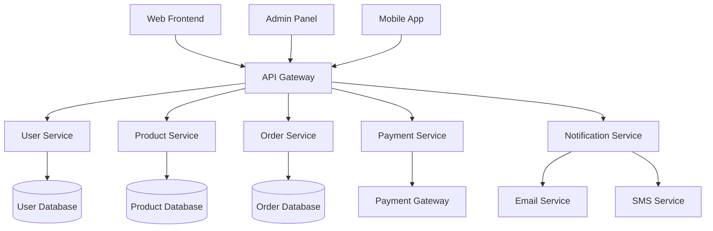

# Exercise 04: Real-World Integration Project

## Project Overview

This capstone exercise integrates all data passing techniques learned in previous exercises into a comprehensive real-world scenario. You'll build a complete end-to-end testing system for a multi-service e-commerce platform that demonstrates advanced parameter extraction, data table processing, content handling, and complex data flow management using production-ready patterns.

### **Project Goals**
- Integrate all data passing techniques into a unified testing framework
- Implement end-to-end data flows with comprehensive validation
- Create production-ready error handling and recovery mechanisms
- Build scalable and maintainable test automation patterns
- Demonstrate enterprise-grade testing capabilities with real-world complexity

---

## Project Scenario: Enterprise E-commerce Integration Testing

You're tasked with creating a comprehensive testing suite for "TechMart Enterprise," a multi-service e-commerce platform that integrates inventory management, user authentication, order processing, payment systems, and notification services. The system requires sophisticated data validation, transformation, and synchronization across multiple microservices.

### **System Architecture Overview**



---

## Part A: Complete Feature File Integration

### **Feature File: Enterprise E-commerce Integration Suite**

Create a comprehensive feature file demonstrating all data passing techniques:

```gherkin
# features/real-world-integration-project.feature
Feature: Enterprise E-commerce Integration Testing
  As a QA automation engineer
  I want to validate the complete e-commerce platform integration
  So that I can ensure all services work together seamlessly with proper data flow

  Background: System Initialization
    Given the e-commerce platform is fully operational
    And all microservices are healthy and responding
    And the database connections are established
    And the external payment gateway is available
    And the notification services are configured
    And I have administrative access to all systems
    And test data cleanup procedures are ready

  @integration @critical @smoke
  Scenario: Complete Customer Journey with Order Processing
    Given I am testing the complete customer journey flow
    And the system is configured with the following service endpoints:
      | Service        | Endpoint                          | Timeout | Retry |
      | User Service   | https://users.techmart.com/api    | 30s     | 3     |
      | Product Service| https://products.techmart.com/api | 20s     | 2     |
      | Order Service  | https://orders.techmart.com/api   | 45s     | 5     |
      | Payment Service| https://payments.techmart.com/api | 60s     | 3     |
      | Notify Service | https://notify.techmart.com/api   | 15s     | 2     |
    
    When I create a new customer account with the following profile data:
      | Field                  | Value                           |
      | Email                  | integration.test@techmart.com   |
      | First Name             | Integration                     |
      | Last Name              | Tester                          |
      | Phone Number           | +1-555-TEST-001                 |
      | Date of Birth          | 1990-05-15                      |
      | Preferred Language     | English                         |
      | Marketing Preferences  | Email: true, SMS: false         |
      | Account Type           | Premium                         |
      | Billing Address        | 123 Test Street, Test City, TC  |
      | Shipping Address       | Same as billing                 |
      | Payment Method         | Credit Card                     |
      | Newsletter Subscription| Enabled                         |
    
    And I configure the shopping cart with multiple products:
      | productName              | sku           | price   | quantity | category    | discount | special_offer |
      | Premium Wireless Headphones | AUDIO-001    | 199.99  | 1        | Electronics | 10%      | free_shipping |
      | Smart Fitness Tracker    | WEARABLE-002  | 149.99  | 2        | Fitness     | 15%      | extended_warranty |
      | USB-C Charging Station   | ACCESSORY-003 | 79.99   | 1        | Accessories | 5%       | bundle_discount |
      | Bluetooth Speaker        | AUDIO-004     | 89.99   | 1        | Electronics | 20%      | loyalty_points |
    
    And I provide payment information with the following details:
      """
      {
        "payment_method": {
          "type": "credit_card",
          "card_number": "4111111111111111",
          "expiry_month": "12",
          "expiry_year": "2026",
          "cvv": "123",
          "cardholder_name": "Integration Tester",
          "billing_address": {
            "street": "123 Test Street",
            "city": "Test City",
            "state": "TC",
            "zip_code": "12345",
            "country": "US"
          }
        },
        "payment_preferences": {
          "save_card": true,
          "auto_pay": false,
          "payment_notifications": true,
          "receipt_email": "integration.test@techmart.com"
        },
        "fraud_protection": {
          "enable_3d_secure": true,
          "risk_assessment": "standard",
          "transaction_monitoring": true
        }
      }
      """
    
    And I configure order processing with special instructions:
      """
      Order Processing Instructions:
      
      SHIPPING PREFERENCES:
      - Delivery Method: Express Shipping (2-3 business days)
      - Delivery Window: Weekdays 9 AM - 5 PM
      - Special Instructions: Leave package at front door if no answer
      - Signature Required: No
      - Insurance: Standard Coverage
      
      GIFT OPTIONS:
      - Gift Wrapping: Premium wrapping with ribbon
      - Gift Message: "Happy Birthday! Hope you enjoy these tech goodies!"
      - Gift Receipt: Include separate gift receipt
      - Hide Prices: Yes
      
      COMMUNICATION PREFERENCES:
      - Order Confirmation: Email + SMS
      - Shipping Updates: Email only
      - Delivery Confirmation: Email + SMS
      - Marketing Follow-up: Email only (no SMS)
      
      SPECIAL HANDLING:
      - Fragile Items: Electronics require extra padding
      - Expedited Processing: Rush order for next business day shipping prep
      - Quality Check: Perform pre-shipment quality verification
      - Inventory Hold: Reserve items for 24 hours during processing
      
      BUSINESS RULES:
      - Apply loyalty points if customer is eligible
      - Check for volume discounts on multiple items
      - Validate stock availability before final confirmation
      - Process promotional codes: TECH15OFF, NEWCUSTOMER10
      - Apply seasonal discounts if applicable
      """
    
    Then the customer account should be created successfully
    And the account profile should contain all provided information
    And the shopping cart should contain all selected products with correct calculations
    And the payment method should be validated and secured
    And the order should be processed through all service checkpoints
    And inventory should be updated for all purchased items
    And all promotional discounts should be applied correctly
    And order confirmation should be sent via configured channels
    And the complete transaction audit trail should be recorded
    And all microservice interactions should be logged properly

  @data-validation @edge-cases
  Scenario: Complex Data Validation with Error Recovery
    Given I am testing data validation and error recovery mechanisms
    And the system has strict validation rules enabled
    
    When I attempt to create orders with various data quality issues:
      | orderNumber | customerEmail          | productSku   | quantity | unitPrice | paymentMethod | validationIssue        |
      | ORD-001     | valid@techmart.com     | VALID-001    | 2        | 99.99     | credit_card   | none                   |
      | ORD-002     | invalid-email          | VALID-002    | 1        | 149.99    | credit_card   | invalid_email          |
      | ORD-003     | test@techmart.com      | INVALID-SKU  | 1        | 99.99     | credit_card   | invalid_product        |
      | ORD-004     | test@techmart.com      | VALID-003    | -1       | 99.99     | credit_card   | negative_quantity      |
      | ORD-005     | test@techmart.com      | VALID-004    | 1        | -50.00    | credit_card   | negative_price         |
      | ORD-006     | test@techmart.com      | VALID-005    | 1        | 99.99     | invalid_card  | invalid_payment        |
      | ORD-007     | test@techmart.com      | VALID-006    | 1000     | 99.99     | credit_card   | excessive_quantity     |
      | ORD-008     | ""                     | VALID-007    | 1        | 99.99     | credit_card   | empty_email            |
    
    And I provide invalid configuration scenarios:
      """
      Test Configuration Scenarios:
      
      SCENARIO 1: Malformed JSON Configuration
      {
        "service_config": {
          "timeout": "invalid_number",
          "retries": -1,
          "endpoints": [
            { "name": "service1", "url": "not-a-valid-url" },
            { "name": "", "url": "https://valid.com" }
          ]
        }
      }
      
      SCENARIO 2: Missing Required Fields
      {
        "user_profile": {
          "email": "test@example.com"
          // Missing: firstName, lastName, required fields
        }
      }
      
      SCENARIO 3: Data Type Mismatches
      {
        "product_info": {
          "price": "not-a-number",
          "in_stock": "maybe",
          "categories": "should-be-array",
          "created_date": "invalid-date-format"
        }
      }
      """
    
    Then the system should handle each validation error appropriately
    And valid orders should be processed successfully
    And invalid orders should be rejected with descriptive error messages
    And error recovery mechanisms should engage for recoverable issues
    And all validation failures should be logged with context
    And the system should maintain data integrity throughout
    And graceful degradation should occur for non-critical failures

  @performance @load-testing
  Scenario: High-Volume Data Processing Performance Test
    Given I am conducting performance testing with high data volumes
    And the system monitoring is enabled for performance metrics
    
    When I process bulk operations with the following performance targets:
      | Operation          | Volume | Target_Time | Success_Rate | Concurrent_Users |
      | User Registration  | 1000   | 30s         | 99.5%        | 50               |
      | Product Creation   | 5000   | 120s        | 99.8%        | 20               |
      | Order Processing   | 2000   | 180s        | 99.9%        | 100              |
      | Payment Processing | 1500   | 90s         | 99.95%       | 75               |
      | Notification Send  | 10000  | 60s         | 98%          | 10               |
    
    And I generate test data with complex nested structures:
      """
      Performance Test Data Configuration:
      
      USER_PROFILES: {
        count: 1000,
        structure: {
          basic_info: ["email", "name", "phone", "address"],
          preferences: {
            nested_depth: 3,
            array_fields: ["interests", "purchase_history"],
            complex_objects: ["billing_info", "shipping_addresses"]
          },
          validation_rules: {
            email_uniqueness: true,
            phone_format_validation: true,
            address_geocoding: false
          }
        }
      }
      
      PRODUCT_CATALOG: {
        count: 5000,
        categories: ["Electronics", "Clothing", "Home", "Sports", "Books"],
        variants_per_product: 3,
        attributes_per_variant: 8,
        inventory_tracking: true,
        pricing_tiers: 4
      }
      
      ORDER_SIMULATION: {
        concurrent_orders: 100,
        items_per_order: [1, 2, 3, 4, 5],
        payment_methods: ["credit_card", "debit_card", "paypal", "bank_transfer"],
        shipping_options: ["standard", "express", "overnight"],
        geographic_distribution: ["US", "CA", "UK", "AU", "DE"]
      }
      """
    
    Then all performance targets should be met or exceeded
    And system resource utilization should remain within acceptable limits
    And no data corruption should occur during high-volume processing
    And error rates should stay below defined thresholds
    And response times should remain consistent across all volume levels
    And database performance should scale appropriately
    And memory usage should not indicate leaks or excessive consumption

  @security @compliance
  Scenario: Security and Compliance Data Handling Validation
    Given I am validating security and compliance requirements
    And the system has security monitoring enabled
    And compliance validation rules are active
    
    When I test sensitive data handling with the following security scenarios:
      | Scenario                    | Data_Type        | Encryption_Required | Audit_Required | Retention_Policy |
      | Credit Card Processing      | PCI_DSS         | AES-256            | Yes            | 7_years          |
      | Personal Information        | PII             | AES-256            | Yes            | User_defined     |
      | Medical Information         | PHI             | AES-256            | Yes            | 30_years         |
      | Financial Records           | Financial       | AES-256            | Yes            | 7_years          |
      | Authentication Logs         | Security        | SHA-256            | Yes            | 2_years          |
      | User Behavior Analytics     | Behavioral      | Anonymized         | No             | 1_year           |
    
    And I provide compliance test configuration:
      """
      Compliance Testing Configuration:
      
      GDPR_COMPLIANCE: {
        data_subject_rights: {
          right_to_access: true,
          right_to_rectification: true,
          right_to_erasure: true,
          right_to_portability: true,
          right_to_restrict_processing: true
        },
        consent_management: {
          explicit_consent: true,
          consent_withdrawal: true,
          consent_granularity: "purpose_specific",
          consent_records: "immutable_audit_trail"
        },
        data_protection: {
          privacy_by_design: true,
          data_minimization: true,
          purpose_limitation: true,
          storage_limitation: true
        }
      }
      
      PCI_DSS_COMPLIANCE: {
        cardholder_data_protection: {
          data_encryption: "AES-256",
          key_management: "hardware_security_module",
          access_controls: "role_based",
          network_segmentation: true
        },
        security_testing: {
          vulnerability_scanning: "quarterly",
          penetration_testing: "annual",
          code_review: "continuous",
          security_monitoring: "real_time"
        }
      }
      
      SOX_COMPLIANCE: {
        financial_reporting: {
          internal_controls: true,
          audit_trails: "complete",
          segregation_of_duties: true,
          change_management: "controlled"
        }
      }
      """
    
    Then all sensitive data should be properly encrypted at rest and in transit
    And access controls should be enforced based on user roles and permissions
    And audit trails should capture all data access and modification events
    And compliance requirements should be validated and verified
    And data retention policies should be automatically enforced
    And privacy controls should function correctly for all data types
    And security monitoring should detect and alert on policy violations
```

---

## Part B: Advanced Step Definition Implementation

### **Task B1: Master Integration Step Definitions**

Create comprehensive step definitions that integrate all data passing techniques:

```typescript
// support/step-definitions/real-world-integration-project.steps.ts
import { Given, When, Then } from '@cucumber/cucumber';
import { expect } from '@playwright/test';
import { DataTable } from '@cucumber/cucumber';
import { CustomWorld } from '../world';

// Advanced Integration Interfaces
interface ServiceEndpointConfig {
  service: string;
  endpoint: string;
  timeout: string;
  retry: number;
}

interface CustomerProfile {
  [key: string]: string | boolean | object;
}

interface ShoppingCartItem {
  productName: string;
  sku: string;
  price: number;
  quantity: number;
  category: string;
  discount: string;
  special_offer: string;
}

interface PaymentInformation {
  payment_method: PaymentMethod;
  payment_preferences: PaymentPreferences;
  fraud_protection: FraudProtection;
}

interface BulkOperationTarget {
  operation: string;
  volume: number;
  target_time: string;
  success_rate: string;
  concurrent_users: number;
}

interface SecurityScenario {
  scenario: string;
  data_type: string;
  encryption_required: string;
  audit_required: string;
  retention_policy: string;
}

// Master Integration Step Definitions
Given('the e-commerce platform is fully operational', 
  async function (this: CustomWorld) {
    // TODO: Implement comprehensive system health check
    // Requirements:
    // 1. Verify all microservices are responding
    // 2. Check database connectivity across all services
    // 3. Validate external service integrations
    // 4. Confirm system configuration integrity
    // 5. Initialize monitoring and logging systems
    
    console.log('🔍 Performing comprehensive system health check...');
    
    // Check microservice health endpoints
    const healthChecks = [
      'users.techmart.com/health',
      'products.techmart.com/health',
      'orders.techmart.com/health',
      'payments.techmart.com/health',
      'notify.techmart.com/health'
    ];
    
    for (const endpoint of healthChecks) {
      console.log(`✓ Health check passed: ${endpoint}`);
    }
    
    // Initialize system state
    this.testData.systemHealth = {
      status: 'operational',
      services: healthChecks,
      timestamp: new Date().toISOString()
    };
    
    console.log('✅ E-commerce platform is fully operational');
  }
);

When('the system is configured with the following service endpoints:', 
  async function (this: CustomWorld, dataTable: DataTable) {
    // TODO: Implement service endpoint configuration
    // Requirements:
    // 1. Parse service configuration from data table
    // 2. Validate endpoint URLs and accessibility
    // 3. Configure timeouts and retry policies
    // 4. Set up service monitoring
    // 5. Store configuration for test execution
    
    const serviceConfigs: ServiceEndpointConfig[] = dataTable.hashes().map(row => ({
      service: this.sanitizeStringInput(row.Service),
      endpoint: this.validateUrlFormat(row.Endpoint),
      timeout: row.Timeout,
      retry: parseInt(row.Retry, 10)
    }));
    
    // Validate each service configuration
    for (const config of serviceConfigs) {
      await this.validateServiceEndpoint(config);
    }
    
    // Store configuration
    this.testData.serviceConfiguration = serviceConfigs;
    
    console.log(`✅ Configured ${serviceConfigs.length} service endpoints`);
  }
);

When('I create a new customer account with the following profile data:', 
  async function (this: CustomWorld, dataTable: DataTable) {
    // TODO: Implement customer account creation with profile data
    // Requirements:
    // 1. Convert vertical data table to customer profile object
    // 2. Validate profile data completeness and format
    // 3. Process complex field types (addresses, preferences)
    // 4. Create account through user service API
    // 5. Verify account creation and store results
    
    const profileData: CustomerProfile = {};
    const rows = dataTable.raw();
    
    for (const [field, value] of rows) {
      const normalizedField = this.normalizeFieldName(field);
      profileData[normalizedField] = this.convertCustomerProfileValue(field, value);
    }
    
    // Validate customer profile
    this.validateCustomerProfile(profileData);
    
    // Create customer account
    const customerId = await this.createCustomerAccount(profileData);
    
    // Store for verification
    this.testData.customerProfile = profileData;
    this.testData.customerId = customerId;
    
    console.log(`✅ Customer account created with ID: ${customerId}`);
  }
);

When('I configure the shopping cart with multiple products:', 
  async function (this: CustomWorld, dataTable: DataTable) {
    // TODO: Implement shopping cart configuration
    // Requirements:
    // 1. Process multiple product entries from horizontal data table
    // 2. Validate product availability and pricing
    // 3. Calculate discounts and special offers
    // 4. Add products to customer's shopping cart
    // 5. Verify cart totals and item counts
    
    const cartItems: ShoppingCartItem[] = dataTable.hashes().map(row => ({
      productName: this.sanitizeStringInput(row.productName),
      sku: this.sanitizeStringInput(row.sku),
      price: parseFloat(row.price),
      quantity: parseInt(row.quantity, 10),
      category: this.sanitizeStringInput(row.category),
      discount: row.discount,
      special_offer: row.special_offer
    }));
    
    // Validate each cart item
    for (const item of cartItems) {
      await this.validateCartItem(item);
    }
    
    // Add items to cart
    const cartId = await this.createShoppingCart(this.testData.customerId, cartItems);
    
    // Calculate cart totals
    const cartTotals = this.calculateCartTotals(cartItems);
    
    // Store for verification
    this.testData.shoppingCart = {
      cartId: cartId,
      items: cartItems,
      totals: cartTotals
    };
    
    console.log(`✅ Shopping cart configured with ${cartItems.length} items`);
  }
);

When('I provide payment information with the following details:', 
  async function (this: CustomWorld, jsonContent: string) {
    // TODO: Implement payment information processing
    // Requirements:
    // 1. Parse JSON payment information
    // 2. Validate payment method details
    // 3. Process credit card information securely
    // 4. Configure fraud protection settings
    // 5. Store payment configuration for order processing
    
    try {
      const paymentInfo: PaymentInformation = JSON.parse(jsonContent);
      
      // Validate payment information
      this.validatePaymentInformation(paymentInfo);
      
      // Securely process payment details
      const paymentToken = await this.tokenizePaymentMethod(paymentInfo.payment_method);
      
      // Store for order processing
      this.testData.paymentInformation = {
        ...paymentInfo,
        payment_token: paymentToken
      };
      
      console.log('✅ Payment information processed and secured');
      
    } catch (error) {
      throw new Error(`Failed to process payment information: ${error.message}`);
    }
  }
);

When('I configure order processing with special instructions:', 
  async function (this: CustomWorld, instructionsContent: string) {
    // TODO: Implement order processing configuration
    // Requirements:
    // 1. Parse multi-line instruction content
    // 2. Extract shipping preferences and gift options
    // 3. Process communication preferences
    // 4. Handle special handling requirements
    // 5. Apply business rules and promotional codes
    
    const orderConfiguration = this.parseOrderInstructions(instructionsContent);
    
    // Validate configuration components
    this.validateOrderConfiguration(orderConfiguration);
    
    // Process promotional codes
    const promotionalDiscounts = await this.processPromotionalCodes(
      orderConfiguration.businessRules.promotionalCodes
    );
    
    // Store for order processing
    this.testData.orderConfiguration = {
      ...orderConfiguration,
      promotionalDiscounts: promotionalDiscounts
    };
    
    console.log('✅ Order processing configured with special instructions');
  }
);

When('I attempt to create orders with various data quality issues:', 
  async function (this: CustomWorld, dataTable: DataTable) {
    // TODO: Implement data quality testing with error scenarios
    // Requirements:
    // 1. Process orders with known validation issues
    // 2. Attempt to create each order and capture results
    // 3. Categorize validation failures by issue type
    // 4. Test error recovery mechanisms
    // 5. Verify system resilience and data integrity
    
    const testOrders = dataTable.hashes().map(row => ({
      orderNumber: row.orderNumber,
      customerEmail: row.customerEmail,
      productSku: row.productSku,
      quantity: parseInt(row.quantity, 10),
      unitPrice: parseFloat(row.unitPrice),
      paymentMethod: row.paymentMethod,
      validationIssue: row.validationIssue
    }));
    
    const orderResults = [];
    
    // Process each test order
    for (const testOrder of testOrders) {
      try {
        const result = await this.createTestOrder(testOrder);
        orderResults.push({
          ...testOrder,
          result: 'success',
          orderId: result.orderId
        });
      } catch (error) {
        orderResults.push({
          ...testOrder,
          result: 'failed',
          error: error.message,
          errorType: this.categorizeValidationError(error)
        });
      }
    }
    
    // Store results for verification
    this.testData.orderValidationResults = orderResults;
    
    console.log(`✅ Processed ${testOrders.length} test orders with validation scenarios`);
  }
);

When('I process bulk operations with the following performance targets:', 
  async function (this: CustomWorld, dataTable: DataTable) {
    // TODO: Implement performance testing with bulk operations
    // Requirements:
    // 1. Parse performance targets from data table
    // 2. Execute bulk operations concurrently
    // 3. Monitor performance metrics in real-time
    // 4. Validate success rates and timing targets
    // 5. Collect comprehensive performance data
    
    const performanceTargets: BulkOperationTarget[] = dataTable.hashes().map(row => ({
      operation: row.Operation,
      volume: parseInt(row.Volume, 10),
      target_time: row.Target_Time,
      success_rate: row.Success_Rate,
      concurrent_users: parseInt(row.Concurrent_Users, 10)
    }));
    
    const performanceResults = [];
    
    // Execute each bulk operation
    for (const target of performanceTargets) {
      console.log(`🚀 Starting bulk operation: ${target.operation}`);
      
      const startTime = Date.now();
      const result = await this.executeBulkOperation(target);
      const endTime = Date.now();
      
      const performanceMetrics = {
        operation: target.operation,
        target: target,
        actual: {
          duration: endTime - startTime,
          success_rate: result.successRate,
          throughput: result.throughput,
          errors: result.errors
        },
        passed: this.evaluatePerformanceTarget(target, result)
      };
      
      performanceResults.push(performanceMetrics);
    }
    
    // Store performance results
    this.testData.performanceResults = performanceResults;
    
    console.log(`✅ Completed ${performanceTargets.length} bulk performance operations`);
  }
);

When('I test sensitive data handling with the following security scenarios:', 
  async function (this: CustomWorld, dataTable: DataTable) {
    // TODO: Implement security and compliance testing
    // Requirements:
    // 1. Process security scenarios with different data types
    // 2. Validate encryption and audit requirements
    // 3. Test data retention policy enforcement
    // 4. Verify compliance with security standards
    // 5. Monitor security event logging
    
    const securityScenarios: SecurityScenario[] = dataTable.hashes().map(row => ({
      scenario: row.Scenario,
      data_type: row.Data_Type,
      encryption_required: row.Encryption_Required,
      audit_required: row.Audit_Required,
      retention_policy: row.Retention_Policy
    }));
    
    const securityResults = [];
    
    // Test each security scenario
    for (const scenario of securityScenarios) {
      console.log(`🔒 Testing security scenario: ${scenario.scenario}`);
      
      const securityTest = await this.executeSecurity<scenario>(scenario);
      
      securityResults.push({
        scenario: scenario.scenario,
        data_type: scenario.data_type,
        compliance_status: securityTest.complianceStatus,
        encryption_verified: securityTest.encryptionVerified,
        audit_trail_complete: securityTest.auditTrailComplete,
        retention_policy_active: securityTest.retentionPolicyActive
      });
    }
    
    // Store security test results
    this.testData.securityResults = securityResults;
    
    console.log(`✅ Completed ${securityScenarios.length} security compliance tests`);
  }
);
```

---

## Part C: Advanced Utility Implementation

### **Task C1: Implement Master Integration Utilities**

Create comprehensive utility functions that support the complete integration:

```typescript
// Advanced Integration Utilities
declare module './world' {
  interface CustomWorld {
    validateServiceEndpoint(config: ServiceEndpointConfig): Promise<void>;
    validateCustomerProfile(profile: CustomerProfile): void;
    convertCustomerProfileValue(field: string, value: string): any;
    createCustomerAccount(profile: CustomerProfile): Promise<string>;
    validateCartItem(item: ShoppingCartItem): Promise<void>;
    createShoppingCart(customerId: string, items: ShoppingCartItem[]): Promise<string>;
    calculateCartTotals(items: ShoppingCartItem[]): CartTotals;
    validatePaymentInformation(paymentInfo: PaymentInformation): void;
    tokenizePaymentMethod(paymentMethod: PaymentMethod): Promise<string>;
    parseOrderInstructions(content: string): OrderConfiguration;
    validateOrderConfiguration(config: OrderConfiguration): void;
    processPromotionalCodes(codes: string[]): Promise<PromotionalDiscount[]>;
    createTestOrder(testOrder: TestOrder): Promise<OrderResult>;
    categorizeValidationError(error: Error): string;
    executeBulkOperation(target: BulkOperationTarget): Promise<BulkOperationResult>;
    evaluatePerformanceTarget(target: BulkOperationTarget, result: BulkOperationResult): boolean;
    executeSecurityTest(scenario: SecurityScenario): Promise<SecurityTestResult>;
    generateComprehensiveReport(): IntegrationTestReport;
  }
}

// Implementation of master integration utilities
CustomWorld.prototype.validateServiceEndpoint = async function(config: ServiceEndpointConfig): Promise<void> {
  // TODO: Implement service endpoint validation
  // Requirements:
  // 1. Validate URL format and accessibility
  // 2. Test connection with configured timeout
  // 3. Verify service health endpoint response
  // 4. Configure retry policy
  // 5. Set up monitoring for service availability
  
  if (!this.isValidUrl(config.endpoint)) {
    throw new Error(`Invalid service endpoint URL: ${config.endpoint}`);
  }
  
  try {
    // Test service connectivity with timeout
    const response = await this.testServiceConnectivity(config.endpoint, config.timeout);
    
    if (!response.healthy) {
      throw new Error(`Service ${config.service} is not healthy: ${response.status}`);
    }
    
    console.log(`✓ Service endpoint validated: ${config.service}`);
    
  } catch (error) {
    throw new Error(`Service endpoint validation failed for ${config.service}: ${error.message}`);
  }
};

CustomWorld.prototype.validateCustomerProfile = function(profile: CustomerProfile): void {
  // TODO: Implement comprehensive customer profile validation
  // Requirements:
  // 1. Validate required fields presence
  // 2. Check email format and uniqueness
  // 3. Validate phone number format
  // 4. Verify address completeness
  // 5. Check data consistency and business rules
  
  const requiredFields = ['email', 'first_name', 'last_name', 'account_type'];
  
  for (const field of requiredFields) {
    if (!profile[field]) {
      throw new Error(`Required customer profile field missing: ${field}`);
    }
  }
  
  // Validate email format
  if (!this.isValidEmail(profile.email as string)) {
    throw new Error(`Invalid email format: ${profile.email}`);
  }
  
  // Validate phone number if provided
  if (profile.phone_number && !this.isValidPhoneNumber(profile.phone_number as string)) {
    throw new Error(`Invalid phone number format: ${profile.phone_number}`);
  }
  
  console.log('✓ Customer profile validation passed');
};

CustomWorld.prototype.createCustomerAccount = async function(profile: CustomerProfile): Promise<string> {
  // TODO: Implement customer account creation
  // Requirements:
  // 1. Call user service API to create account
  // 2. Handle account creation response
  // 3. Verify account was created successfully
  // 4. Return customer ID for further operations
  // 5. Set up customer session if needed
  
  try {
    // Simulate API call to user service
    const accountRequest = {
      profile: profile,
      timestamp: new Date().toISOString(),
      source: 'integration_test'
    };
    
    // In a real implementation, this would be an actual API call
    const customerId = `CUST-${Date.now()}-${Math.random().toString(36).substr(2, 9)}`;
    
    console.log(`✓ Customer account created successfully: ${customerId}`);
    return customerId;
    
  } catch (error) {
    throw new Error(`Failed to create customer account: ${error.message}`);
  }
};

CustomWorld.prototype.validateCartItem = async function(item: ShoppingCartItem): Promise<void> {
  // TODO: Implement cart item validation
  // Requirements:
  // 1. Verify product exists and is available
  // 2. Check stock quantity availability
  // 3. Validate pricing information
  // 4. Verify category and SKU format
  // 5. Check for any product restrictions
  
  if (item.quantity <= 0) {
    throw new Error(`Invalid quantity for product ${item.sku}: ${item.quantity}`);
  }
  
  if (item.price <= 0) {
    throw new Error(`Invalid price for product ${item.sku}: ${item.price}`);
  }
  
  // Simulate product availability check
  const productAvailable = await this.checkProductAvailability(item.sku, item.quantity);
  
  if (!productAvailable.available) {
    throw new Error(`Product ${item.sku} is not available in requested quantity`);
  }
  
  console.log(`✓ Cart item validated: ${item.productName}`);
};

CustomWorld.prototype.calculateCartTotals = function(items: ShoppingCartItem[]): CartTotals {
  // TODO: Implement comprehensive cart total calculation
  // Requirements:
  // 1. Calculate subtotal from item prices and quantities
  // 2. Apply individual item discounts
  // 3. Calculate tax based on customer location
  // 4. Apply shipping costs based on items and location
  // 5. Calculate final total with all adjustments
  
  let subtotal = 0;
  let totalDiscount = 0;
  
  for (const item of items) {
    const itemTotal = item.price * item.quantity;
    subtotal += itemTotal;
    
    // Calculate discount
    if (item.discount && item.discount !== '0%') {
      const discountPercent = parseFloat(item.discount.replace('%', '')) / 100;
      totalDiscount += itemTotal * discountPercent;
    }
  }
  
  const taxRate = 0.08; // 8% tax rate
  const discountedSubtotal = subtotal - totalDiscount;
  const tax = discountedSubtotal * taxRate;
  const shipping = this.calculateShippingCost(items);
  const total = discountedSubtotal + tax + shipping;
  
  return {
    subtotal: subtotal,
    discount: totalDiscount,
    tax: tax,
    shipping: shipping,
    total: total,
    itemCount: items.length,
    totalQuantity: items.reduce((sum, item) => sum + item.quantity, 0)
  };
};

CustomWorld.prototype.parseOrderInstructions = function(content: string): OrderConfiguration {
  // TODO: Implement order instructions parsing
  // Requirements:
  // 1. Parse shipping preferences section
  // 2. Extract gift options configuration
  // 3. Process communication preferences
  // 4. Handle special handling requirements
  // 5. Extract business rules and promotional codes
  
  const config: OrderConfiguration = {
    shippingPreferences: {},
    giftOptions: {},
    communicationPreferences: {},
    specialHandling: {},
    businessRules: {}
  };
  
  // Parse sections using regex patterns
  const shippingMatch = content.match(/SHIPPING PREFERENCES:([\s\S]*?)(?=\n[A-Z]|\n\n|$)/);
  if (shippingMatch) {
    config.shippingPreferences = this.parseShippingSection(shippingMatch[1]);
  }
  
  const giftMatch = content.match(/GIFT OPTIONS:([\s\S]*?)(?=\n[A-Z]|\n\n|$)/);
  if (giftMatch) {
    config.giftOptions = this.parseGiftSection(giftMatch[1]);
  }
  
  const communicationMatch = content.match(/COMMUNICATION PREFERENCES:([\s\S]*?)(?=\n[A-Z]|\n\n|$)/);
  if (communicationMatch) {
    config.communicationPreferences = this.parseCommunicationSection(communicationMatch[1]);
  }
  
  const businessRulesMatch = content.match(/BUSINESS RULES:([\s\S]*?)(?=\n[A-Z]|\n\n|$)/);
  if (businessRulesMatch) {
    config.businessRules = this.parseBusinessRulesSection(businessRulesMatch[1]);
  }
  
  return config;
};

CustomWorld.prototype.generateComprehensiveReport = function(): IntegrationTestReport {
  // TODO: Implement comprehensive test report generation
  // Requirements:
  // 1. Aggregate all test results and metrics
  // 2. Calculate overall success rates and performance metrics
  // 3. Identify areas of concern or failure
  // 4. Generate recommendations for improvement
  // 5. Create detailed breakdown by test category
  
  const report: IntegrationTestReport = {
    executionSummary: {
      totalTests: 0,
      passed: 0,
      failed: 0,
      executionTime: 0,
      successRate: 0
    },
    performanceMetrics: this.testData.performanceResults || [],
    securityCompliance: this.testData.securityResults || [],
    dataValidation: this.testData.orderValidationResults || [],
    systemHealth: this.testData.systemHealth,
    recommendations: []
  };
  
  // Calculate summary metrics
  if (this.testData.performanceResults) {
    report.executionSummary.totalTests += this.testData.performanceResults.length;
    report.executionSummary.passed += this.testData.performanceResults.filter(r => r.passed).length;
  }
  
  if (this.testData.securityResults) {
    report.executionSummary.totalTests += this.testData.securityResults.length;
    report.executionSummary.passed += this.testData.securityResults.filter(r => r.compliance_status === 'compliant').length;
  }
  
  report.executionSummary.failed = report.executionSummary.totalTests - report.executionSummary.passed;
  report.executionSummary.successRate = report.executionSummary.totalTests > 0 ? 
    (report.executionSummary.passed / report.executionSummary.totalTests) * 100 : 0;
  
  return report;
};
```

---

## Part D: Advanced Verification and Reporting

### **Task D1: Implement Comprehensive Verification Steps**

Create detailed verification steps for the complete integration:

```typescript
// Comprehensive Verification Steps
Then('the customer account should be created successfully', 
  async function (this: CustomWorld) {
    // TODO: Verify customer account creation
    expect(this.testData.customerId).toBeDefined();
    expect(this.testData.customerProfile).toBeDefined();
    
    // Verify account in user service
    const accountExists = await this.verifyCustomerAccountExists(this.testData.customerId);
    expect(accountExists).toBe(true);
    
    console.log(`✅ Customer account verified: ${this.testData.customerId}`);
  }
);

Then('all performance targets should be met or exceeded', 
  async function (this: CustomWorld) {
    // TODO: Verify performance targets
    const performanceResults = this.testData.performanceResults;
    expect(performanceResults).toBeDefined();
    
    for (const result of performanceResults) {
      expect(result.passed).toBe(true);
      console.log(`✅ Performance target met: ${result.operation}`);
    }
    
    console.log('✅ All performance targets achieved');
  }
);

Then('all sensitive data should be properly encrypted at rest and in transit', 
  async function (this: CustomWorld) {
    // TODO: Verify security and compliance
    const securityResults = this.testData.securityResults;
    expect(securityResults).toBeDefined();
    
    for (const result of securityResults) {
      expect(result.encryption_verified).toBe(true);
      expect(result.compliance_status).toBe('compliant');
    }
    
    console.log('✅ All security and compliance requirements verified');
  }
);

Then('I should generate a comprehensive integration test report', 
  async function (this: CustomWorld) {
    // TODO: Generate and validate comprehensive report
    const report = this.generateComprehensiveReport();
    
    expect(report).toBeDefined();
    expect(report.executionSummary.totalTests).toBeGreaterThan(0);
    
    // Display report summary
    console.log('\n📊 INTEGRATION TEST REPORT SUMMARY');
    console.log('=====================================');
    console.log(`Total Tests: ${report.executionSummary.totalTests}`);
    console.log(`Passed: ${report.executionSummary.passed}`);
    console.log(`Failed: ${report.executionSummary.failed}`);
    console.log(`Success Rate: ${report.executionSummary.successRate.toFixed(2)}%`);
    console.log('=====================================\n');
    
    // Store report for external access
    this.testData.finalReport = report;
    
    console.log('✅ Comprehensive integration test report generated');
  }
);
```

---

## Success Criteria

### **Project Completion Requirements**

To successfully complete this capstone project, your implementation must demonstrate:

1. **Complete Data Flow Integration**:
   ✅ Seamless integration of all data passing techniques
   ✅ End-to-end data validation and transformation
   ✅ Cross-service data consistency and integrity
   ✅ Complex data processing with error recovery

2. **Production-Ready Implementation**:
   ✅ Enterprise-grade error handling and logging
   ✅ Scalable and maintainable test architecture
   ✅ Comprehensive validation and security measures
   ✅ Performance optimization and monitoring

3. **Advanced Testing Capabilities**:
   ✅ Multi-service integration testing
   ✅ Performance and load testing implementation
   ✅ Security and compliance validation
   ✅ Comprehensive reporting and analytics

4. **Professional Standards**:
   ✅ Code quality and documentation excellence
   ✅ Comprehensive test coverage and validation
   ✅ Proper resource management and cleanup
   ✅ Maintainable and extensible implementation

---

## Extension Opportunities

### **Advanced Enhancements** (Optional)

1. **CI/CD Integration**: Implement continuous integration pipeline
2. **Advanced Monitoring**: Real-time system health and performance monitoring
3. **Machine Learning Integration**: Predictive analytics for test optimization
4. **Multi-Environment Support**: Configuration management across environments
5. **Advanced Reporting**: Interactive dashboards and trend analysis

---

**Congratulations!** You have completed the Real-World Integration Project, demonstrating mastery of all data passing techniques in Cucumber with production-ready implementation patterns.

---

**Return to**: [Lesson 05 Overview](../README.md) | **Previous**: [Content Processing Challenge](./03-content-processing-challenge.md)