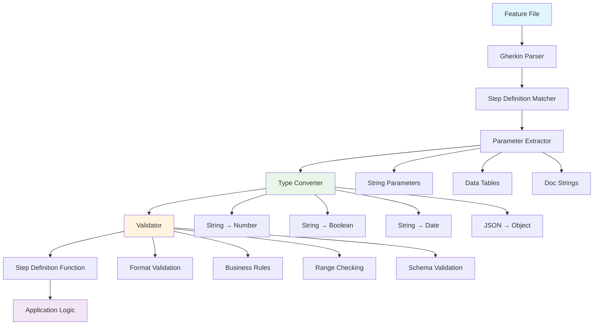
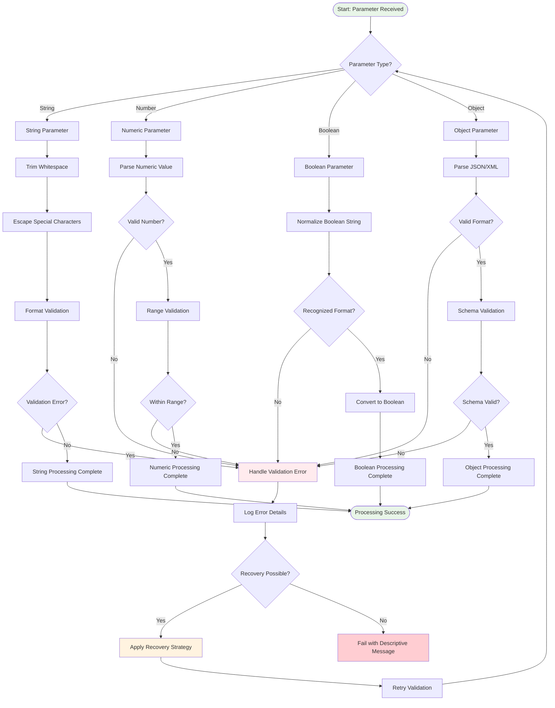
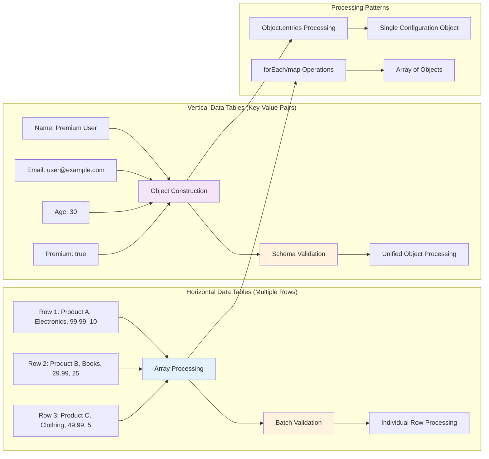
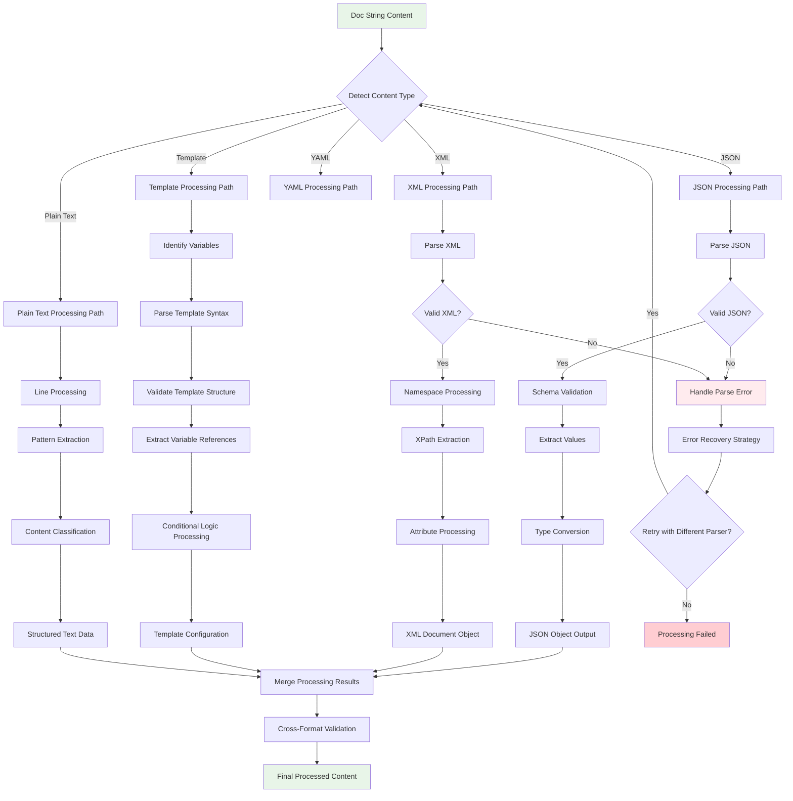
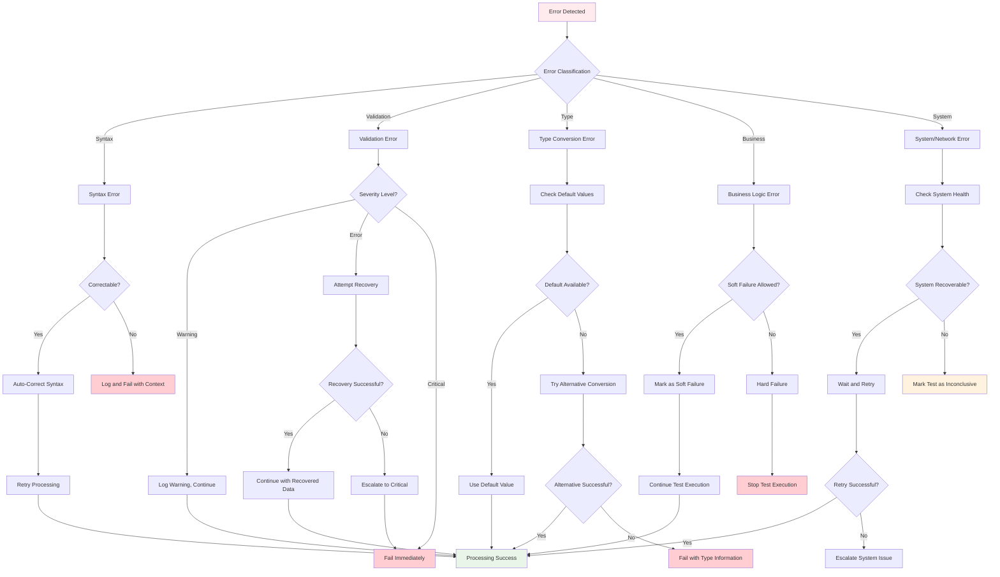
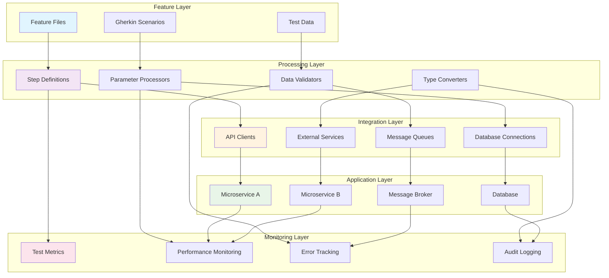

# Visual Learning Aids: Passing Data from Feature Files to Step Definitions

This directory contains comprehensive visual learning aids designed to reinforce understanding of data passing techniques in Cucumber through diagrams, flowcharts, and interactive visual examples. Each visual aid corresponds to specific learning objectives and provides multiple perspectives on complex concepts.

## Learning Objective Alignment

| Visual Aid | Learning Objectives | Complexity Level | Format |
|------------|-------------------|------------------|---------| 
| [Data Flow Architecture](#data-flow-architecture) | Parameter extraction, Data validation | Intermediate | Flowchart |
| [Parameter Processing Pipeline](#parameter-processing-pipeline) | Type conversion, Validation | Advanced | Process Diagram |
| [Data Table Processing](#data-table-processing) | Horizontal/Vertical tables | Intermediate | Comparison Chart |
| [Content Processing Workflow](#content-processing-workflow) | Doc strings, JSON/XML | Advanced | Workflow Diagram |
| [Error Handling Strategy](#error-handling-strategy) | Error recovery, Validation | Advanced | Decision Tree |
| [Integration Architecture](#integration-architecture) | End-to-end flow | Expert | System Architecture |

---

## Data Flow Architecture

### **Concept Overview**
Visual representation of how data flows from Gherkin feature files through step definitions to application logic, showing the complete data transformation pipeline.

**Key Learning Points:**
- Data undergoes multiple transformation stages
- Each stage has specific responsibilities and error handling
- Type conversion happens before validation
- Validation can occur at multiple levels

---

## Parameter Processing Pipeline

### **Detailed Processing Flow**
Comprehensive view of parameter processing showing decision points, error handling, and optimization opportunities.

**Processing Strategies:**
- **Fail Fast**: Immediate error on first validation failure
- **Error Recovery**: Attempt to correct common input errors
- **Graceful Degradation**: Continue with warnings for non-critical issues
- **Progressive Enhancement**: Apply additional validations based on context

---

## Data Table Processing

### **Horizontal vs Vertical Data Table Processing**
Comparative analysis showing when to use each approach and their respective processing patterns.

**Decision Matrix:**

| Scenario | Use Horizontal Tables | Use Vertical Tables |
|----------|----------------------|---------------------|
| Multiple similar records | ✅ | ❌ |
| Single complex configuration | ❌ | ✅ |
| Bulk operations | ✅ | ❌ |
| Profile/settings data | ❌ | ✅ |
| Variable number of items | ✅ | ❌ |
| Fixed configuration schema | ❌ | ✅ |

---

## Content Processing Workflow

### **Multi-Format Content Processing**
Comprehensive workflow showing how different content formats are processed and validated.

**Content Processing Capabilities:**

| Format | Parsing | Validation | Transformation | Error Recovery |
|--------|---------|------------|---------------|----------------|
| JSON | ✅ Native | ✅ Schema | ✅ Object mapping | ✅ Format correction |
| XML | ✅ DOM/SAX | ✅ XSD/DTD | ✅ XPath queries | ✅ Namespace repair |
| YAML | ✅ LibYAML | ✅ Schema | ✅ Object mapping | ✅ Indentation fix |
| Templates | ✅ Custom | ✅ Syntax | ✅ Variable substitution | ✅ Syntax repair |
| Plain Text | ✅ Line-based | ✅ Pattern | ✅ Structure extraction | ✅ Encoding fix |

---

## Error Handling Strategy

### **Comprehensive Error Recovery Decision Tree**
Detailed decision tree showing error categorization and recovery strategies for robust test execution.

**Error Recovery Strategies:**

| Error Type | Recovery Methods | Fallback Options | Reporting Level |
|------------|------------------|------------------|-----------------|
| **Syntax** | Auto-correction, Format repair | Manual intervention | Error |
| **Validation** | Default values, Range adjustment | Skip validation | Warning/Error |
| **Type Conversion** | Alternative parsers, Defaults | String preservation | Error |
| **Business Logic** | Rule relaxation, Override flags | Test continuation | Warning |
| **System** | Retry with backoff, Circuit breaker | Test postponement | Critical |

---

## Integration Architecture

### **End-to-End System Integration View**
Complete architectural overview showing how data passing integrates with the entire testing ecosystem.

**Integration Patterns:**

| Pattern | Use Case | Data Flow | Error Handling |
|---------|----------|-----------|----------------|
| **Request-Response** | API testing | Synchronous | Immediate feedback |
| **Event-Driven** | Message processing | Asynchronous | Event correlation |
| **Batch Processing** | Bulk operations | Queued | Batch error handling |
| **Stream Processing** | Real-time data | Continuous | Stream error recovery |

---

## Usage Guidelines

### **Visual Aid Selection Matrix**

| Learning Objective | Recommended Visuals | Study Approach |
|-------------------|-------------------|----------------|  
| **Understanding Data Flow** | Data Flow Architecture + Parameter Pipeline | Sequential study |
| **Mastering Data Tables** | Data Table Processing + Error Handling | Comparative analysis |
| **Content Processing** | Content Workflow + Integration Architecture | End-to-end perspective |
| **Error Management** | Error Handling Strategy + Processing Pipeline | Decision-tree approach |
| **System Integration** | Integration Architecture + All supporting diagrams | Holistic view |

### **Interactive Learning Suggestions**

1. **Trace Data Flow**: Use the diagrams to trace how specific data moves through the system
2. **Decision Points**: Identify decision points in workflows and consider alternative paths  
3. **Error Scenarios**: Use error handling diagrams to plan test scenarios
4. **Pattern Recognition**: Compare patterns across different visual aids to identify common themes
5. **Architecture Understanding**: Build mental models using the integration architecture view

---

## Additional Resources

### **Diagram Tools and Formats**
- **Mermaid Diagrams**: Interactive, version-controlled, and easily updated
- **PlantUML**: Alternative format for complex system diagrams
- **Draw.io/Lucidchart**: For custom modifications and team collaboration
- **Interactive HTML**: Hover states and clickable elements for enhanced learning

### **Customization Options**
- **Color Coding**: Consistent color schemes across all diagrams
- **Complexity Levels**: Simplified versions for beginners, detailed for advanced learners
- **Format Variations**: Static images, interactive web components, and printable versions
- **Language Support**: Diagrams can be adapted for different programming languages

---

**Navigation**: [Return to Lesson 05](../README.md) | **Next**: [Assessment](../assessment.md)