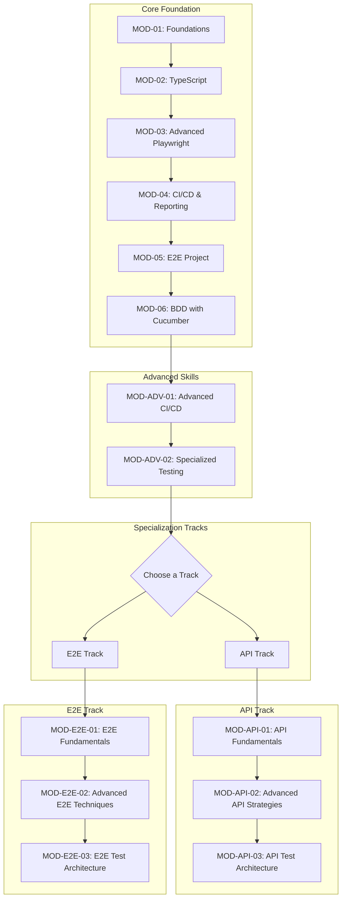

# The Recommended Learning Path

Welcome to your roadmap for success! This document outlines the recommended path through the course curriculum. While you are free to explore modules as you wish, following this path ensures a logical and progressive learning experience, where each new concept builds upon the last.

---

## The Journey Ahead: From Foundation to Specialization

Our curriculum is structured in three distinct phases. This ensures you master the fundamentals before moving on to advanced topics and then choosing a specialization that aligns with your career goals.

---

## Phase 1: Core Foundation (Modules 01-06)

**Objective**: To build a strong and comprehensive foundation in QA automation, from basic web concepts to building a full-fledged test framework.

This is the **mandatory** part of the course for anyone new to automation. Do not skip these modules, as they provide the essential skills needed for the more advanced topics.

1.  **[MOD-01: Foundations of QA and Web Technologies](./../MOD-01_Foundations/)**: Start here. Get comfortable with the basics of testing, HTML, CSS, and JavaScript.
2.  **[MOD-02: TypeScript for Automation Engineers](./../MOD-02_TypeScript_for_Automation/)**: Learn the programming language you'll use throughout the course.
3.  **[MOD-03: Advanced Playwright and Test Architecture](./../MOD-03_Advanced_Playwright_and_Test_Architecture/)**: Master Playwright and learn how to structure your tests effectively.
4.  **[MOD-04: CI/CD and Reporting](./../MOD-04_CI_CD_and_Reporting/)**: Understand how to automate your automation and report on your findings.
5.  **[MOD-05: End-to-End Project and Career Development](./../MOD-05_End_to_End_Project_and_Career_Development/)**: Apply your knowledge in a capstone project and prepare for your job search.
6.  **[MOD-06: Behavior-Driven Development (BDD) with Cucumber](./../MOD-06_Behavior_Driven_Development_BDD_with_Cucumber/)**: Learn how to write tests that everyone on the team can understand.

---

## Phase 2: Advanced Skills (Modules ADV-01 & ADV-02)

**Objective**: To broaden your skill set with advanced topics that are highly sought after in the industry.

Once you have a solid grasp of the core concepts, these modules will make you a more well-rounded and valuable engineer.

1.  **[MOD-ADV-01: CI/CD and DevOps Integration](./../MOD-ADV-01_CI_CD_and_DevOps_Integration/)**: Go deeper into CI/CD and understand how testing fits into the larger DevOps picture.
2.  **[MOD-ADV-02: Specialized Testing Topics](./../MOD-ADV-02_Specialized_Testing_Topics/)**: Get introduced to other important testing types like performance, visual, and accessibility testing.

---

## Phase 3: Specialization Tracks

**Objective**: To develop deep expertise in a specific area of test automation.

After completing the core and advanced modules, you can choose to specialize. This is your opportunity to tailor your learning to the type of role you want to pursue.

### Option A: API Testing Track

Choose this track if you are interested in focusing on backend testing, which is a critical and in-demand skill.

1.  **[MOD-API-01: API Testing Fundamentals with Playwright](./../MOD-API-01_API_Testing_Fundamentals_with_Playwright/)**
2.  **[MOD-API-02: Advanced API Testing Strategies](./../MOD-API-02_Advanced_API_Testing_Strategies/)**
3.  **[MOD-API-03: API Test Architecture and Contracts](./../MOD-API-03_API_Test_Architecture_and_Contracts/)**

### Option B: End-to-End (E2E) Testing Track

Choose this track if you want to become an expert in UI automation and build complex, enterprise-grade E2E test suites.

1.  **[MOD-E2E-01: Playwright E2E Fundamentals](./../MOD-E2E-01_Playwright_E2E_Fundamentals/)**
2.  **[MOD-E2E-02: Advanced E2E Testing Techniques](./../MOD-E2E-02_Advanced_E2E_Testing_Techniques/)**
3.  **[MOD-E2E-03: E2E Test Architecture and Design](./../MOD-E2E-03_E2E_Test_Architecture_and_Design/)**

---

Your journey is your own. Use this guide to help you navigate it, but feel free to revisit modules or explore topics that you find particularly interesting. Happy learning!