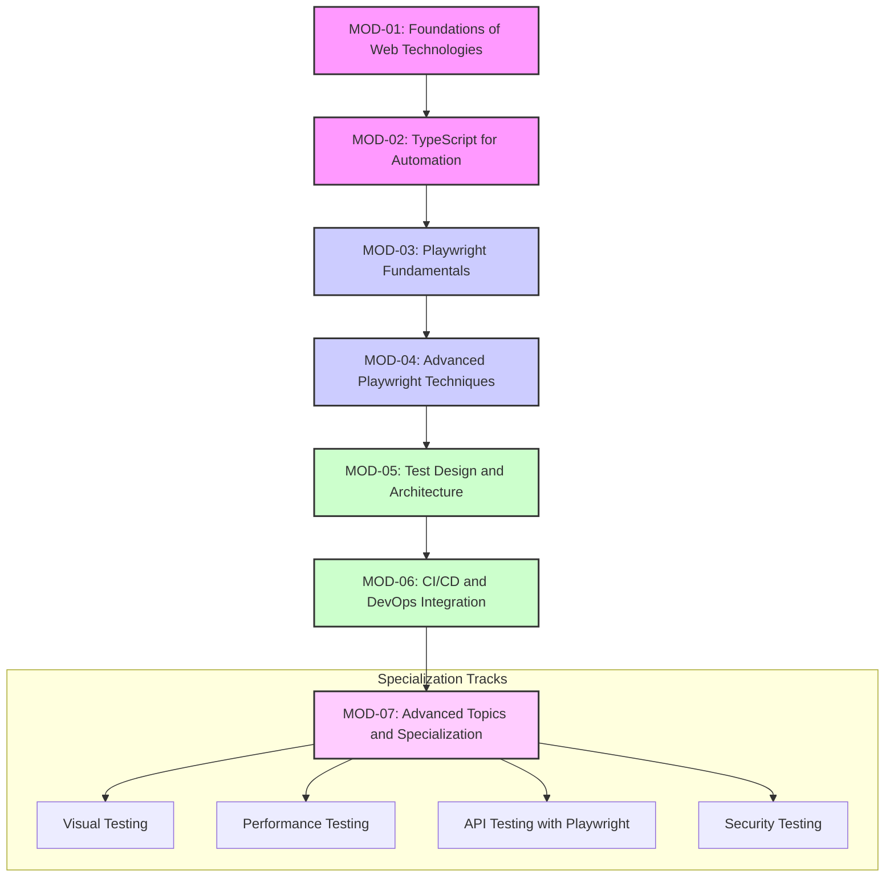

# Comprehensive Learning Roadmap: Playwright QA Automation

This document outlines the master plan for the learning-playwright project, guiding content creation, resource integration, and learner progression from complete beginner to professional QA automation engineer specializing in Playwright with TypeScript.

> 📚 **Documentation Navigation**:
> - [Project Overview](project-overview.md) - Executive summary and research findings
> - [Implementation Guide](implementation-guide.md) - Content creation and instruction guide
> - [Resource Documentation](resources/README.md) - 25+ curated free resources
> - [Learning Paths](resources/learning-paths.md) - Personalized learning journeys

## 1. Vision and Philosophy

Our vision is to create the most comprehensive, practical, and beginner-friendly roadmap for learning Playwright. The core philosophy is based on:

-   **Progressive Learning:** A structured path from foundational concepts to advanced specialization.
-   **Practical Application:** A strong emphasis on hands-on learning and real-world projects.
-   **Community-Driven:** Leveraging the best free online resources and fostering a collaborative learning environment.

## 2. The 7-Module Structure

The roadmap is built around a 7-module structure that takes a learner from zero to hero.

### Module Breakdown

| Module ID | Module Name | Focus |
| :--- | :--- | :--- |
| **MOD-01** | [Foundations of Web Technologies](./resources/categories/01-official-documentation.md) | HTML, CSS, HTTP, DevTools |
| **MOD-02** | [TypeScript for Automation](./resources/categories/01-official-documentation.md) | TypeScript from basics to advanced |
| **MOD-03** | [Playwright Fundamentals](./resources/categories/06-practice-resources.md) | Core concepts, first tests, locators |
| **MOD-04** | [Advanced Playwright Techniques](./resources/categories/04-community-resources.md) | Auth, network, file I/O, API testing |
| **MOD-05** | [Test Design and Architecture](./resources/categories/07-best-practices.md) | POM, data management, best practices |
| **MOD-06** | [CI/CD and DevOps Integration](./resources/categories/05-tools-integration.md) | GitHub Actions, Docker, parallelization |
| **MOD-07** | [Advanced Topics and Specialization](./resources/categories/07-best-practices.md) | Visual, performance, accessibility testing |

## 3. Learning Paths

We cater to four distinct learner profiles, each with a tailored path through the modules. Detailed learning journeys, including resource suggestions for each step, are available in the [Learning Paths Guide](./resources/guides/learning-paths.md).

| Path | Target Audience | Duration | Entry Point |
| :--- | :--- | :--- | :--- |
| **A: Complete Beginner** | No programming experience | 16-20 weeks | MOD-01 |
| **B: Programmer** | New to testing | 10-12 weeks | MOD-02 |
| **C: Manual Tester** | New to Playwright | 6-8 weeks | MOD-03 |
| **D: Advanced Practitioner** | Specialization focus | 4-6 weeks | MOD-07 |

## 4. Resource Integration Plan

Our curriculum is powered by a curated collection of over 24 of the best free online resources. These have been meticulously organized into a comprehensive resource library.

-   **Resource Integration**: Each module is supported by a set of specific resources. See the full breakdown in the [Module-Resource Mapping guide](./resources/guides/module-mapping.md).
-   **8 Essential (⭐⭐⭐⭐⭐) resources** are deeply integrated into the core curriculum.
-   **Resource Curation**: All resources are detailed in the [Master Resource Index](./resources/master-resource-index.md).
-   **Resource updates** are planned quarterly to ensure all materials are current (2024-2025 focus).

## 5. Assessment Strategy

Learning is measured through a combination of practical and theoretical assessments.

-   **Quizzes:** At the end of each module to test theoretical knowledge.
-   **Hands-on Exercises:** Integrated throughout each module to reinforce practical skills.
-   **Final Projects:** A capstone project at the end of each module to demonstrate mastery.
-   **Peer Code Reviews:** To foster collaboration and improve code quality.

## 6. Implementation Timeline

-   **Phase 1 (Q3 2025):** Content creation for MOD-01 and MOD-02.
-   **Phase 2 (Q4 2025):** Content creation for MOD-03 and MOD-04.
-   **Phase 3 (Q1 2026):** Content creation for MOD-05 and MOD-06.
-   **Phase 4 (Q2 2026):** Content creation for MOD-07 and launch of the full program.

## 7. Success Metrics

-   **Completion Rate:** Percentage of learners who complete the entire roadmap.
-   **Community Engagement:** Active participation in forums and discussion boards.
-   **Portfolio Quality:** The quality of the projects in learner portfolios.
-   **Career Advancement:** The number of learners who successfully transition into QA automation roles.

This roadmap provides a clear and comprehensive plan for the development of the learning-playwright project. It is designed to be a living document, and will be updated regularly to reflect the latest trends and technologies in the world of QA automation.