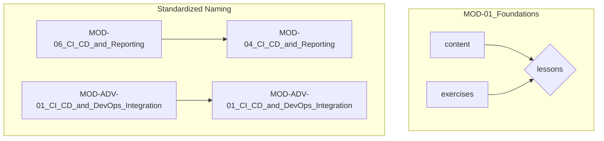

# Architectural Improvement: Implementation Plan

This document outlines the plan to implement the approved architectural improvements.

## 1. Consolidate `MOD-01_Foundations` Directory

The current structure of `MOD-01_Foundations` has redundant `content` and `exercises` directories. This will be resolved by moving their contents into the appropriate `lessons` subdirectories.

### Current Structure:
```
MOD-01_Foundations/
├── content/
├── exercises/
└── lessons/
    ├── lesson-01/
    ...
```

### Proposed Structure:
```
MOD-01_Foundations/
└── lessons/
    ├── lesson-01/
    │   ├── content.md
    │   └── exercises.md
    ...
```

## 2. Standardize Module Naming and Numbering

The module naming and numbering will be standardized to ensure consistency across the project.

### Current Naming:
- `MOD-06_CI_CD_and_Reporting`
- `MOD-ADV-01_CI_CD_and_DevOps_Integration`

### Proposed Naming:
- `MOD-04_CI_CD_and_Reporting`
- `MOD-05_Advanced_Playwright_and_Test_Architecture`
- `MOD-06_Behavior_Driven_Development_BDD_with_Cucumber`
- `MOD-07_End_to_End_Project_and_Career_Development`
- `MOD-ADV-01_CI_CD_and_DevOps_Integration`
- `MOD-ADV-02_Specialized_Testing_Topics`

## 3. Mermaid Diagram of Proposed Changes



This plan will be executed upon approval.