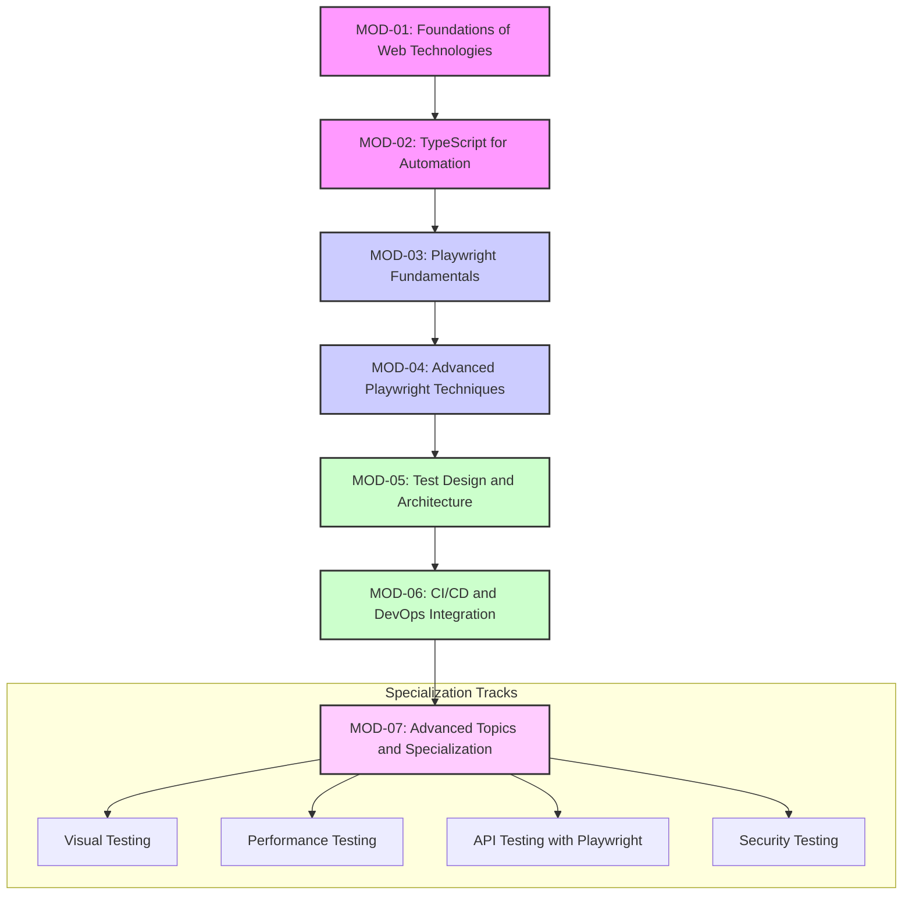

# Comprehensive Learning Roadmap: Playwright QA Automation

This document outlines the master plan for the learning-playwright project, guiding content creation, resource integration, and learner progression from complete beginner to professional QA automation engineer specializing in Playwright with TypeScript.

> 📚 **Documentation Navigation**:
> - [Project Overview](../project-overview.md) - Executive summary and research findings
> - [Implementation Guide](../guides/implementation-guide.md) - Content creation and instruction guide
> - [Resource Documentation](resources/README.md) - 25+ curated free resources
> - [Learning Paths](../resources/guides/learning-paths.md) - Personalized learning journeys

## 1. Vision and Philosophy

Our vision is to create the most comprehensive, practical, and beginner-friendly roadmap for learning Playwright. The core philosophy is based on:

-   **Progressive Learning:** A structured path from foundational concepts to advanced specialization.
-   **Practical Application:** A strong emphasis on hands-on learning and real-world projects.
-   **Community-Driven:** Leveraging the best free online resources and fostering a collaborative learning environment.

## 2. The 7-Module Structure

The roadmap is built around a 7-module structure that takes a learner from zero to hero.



### Granular Folder Structure

To enhance modularity and clarity, each module is organized into a more granular folder structure. This approach breaks down large modules into smaller, more manageable lessons, each self-contained with its own learning materials.

-   **Module-Level Directory**: Each module has a primary directory (e.g., `MOD-01_Foundations/`).
-   **Lessons Directory**: Inside each module, a `lessons/` directory contains all the individual lesson folders.
-   **Lesson-Specific Folders**: Each lesson is housed in its own folder, named descriptively (e.g., `lesson-01-html-document-structure/`).
-   **Lesson-Specific Content**: Within each lesson's folder, you will find dedicated directories for `examples/` and `exercises/`, ensuring that practical applications are tightly coupled with the theoretical content.

This structure is designed to make the curriculum easier to navigate, contribute to, and maintain.

---

## 📋 Executive Summary

### Enhanced 7-Module Structure Overview

The enhanced Learning Playwright roadmap integrates comprehensive API testing throughout the curriculum while maintaining strong E2E testing coverage. This balanced approach ensures learners develop expertise in both testing methodologies.

| Module | Name | Duration | Lessons | API Lessons | E2E Lessons | Key Focus |
|--------|------|----------|---------|-------------|-------------|-----------|
| **MOD-01** | Foundations of Web Technologies | 4-5 weeks | 12 lessons | 3 lessons | 2 lessons | HTML, CSS, HTTP, APIs, DevTools |
| **MOD-02** | TypeScript for Automation | 5-6 weeks | 14 lessons | 3 lessons | 2 lessons | TypeScript fundamentals + API patterns |
| **MOD-03** | Playwright Fundamentals | 4-5 weeks | 16 lessons | 4 lessons | 8 lessons | Setup, locators, actions, API + E2E intro |
| **MOD-04** | Advanced Playwright Techniques | 6-7 weeks | 16 lessons | 6 lessons | 6 lessons | Auth, network, API testing, E2E advanced |
| **MOD-05** | Test Design and Architecture | 5-6 weeks | 12 lessons | 3 lessons | 5 lessons | POM, API patterns, architecture |
| **MOD-06** | CI/CD and DevOps Integration | 4-5 weeks | 10 lessons | 2 lessons | 4 lessons | GitHub Actions, Docker, API + E2E in CI |
| **MOD-07** | Advanced Topics and Specialization | 5-7 weeks | 12 lessons | 3 lessons | 5 lessons | Visual, performance, API security, E2E advanced |

**Enhanced Totals**: 
- **Total Duration**: 33-41 weeks 
- **Total Lessons**: 92 lessons (+16 from original)
- **API Testing**: 24 lessons (~26% coverage)
- **E2E Testing**: 32 lessons (~35% coverage) 
- **Foundation/Other**: 36 lessons (~39% coverage)
- **Total Time**: 250-350 hours

---

## 🏗️ Detailed Module Breakdown

## MOD-01: Foundations of Web Technologies (Enhanced)

**Duration**: 4-5 weeks | **Time Commitment**: 12-15 hours/week | **Prerequisites**: None

### Module Overview
Establishes foundational understanding of web technologies essential for both API and E2E automation testing. Enhanced with comprehensive API fundamentals and REST principles.

### Enhanced Lesson Breakdown

#### **Lesson 1.1: HTML Document Structure and Semantic Elements**
**Duration**: 1-2 hours | **Type**: Foundation
**Learning Outcome**: Understand HTML5 document structure and identify semantic elements

**Documentation**: 
- HTML5 document structure (DOCTYPE, html, head, body)
- Semantic elements (header, nav, main, section, article, aside, footer)
- Difference between semantic and non-semantic elements
- Impact on both visual testing and API data structure

**Example**:
```html
<!DOCTYPE html>
<html lang="en">
<head>
    <meta charset="UTF-8">
    <title>Sample Page</title>
</head>
<body>
    <header>
        <nav>Navigation</nav>
    </header>
    <main>
        <section data-testid="content-section">Content Section</section>
    </main>
    <footer>Footer Content</footer>
</body>
</html>
```

**Practical Test**:
- Create a basic HTML page with proper semantic structure
- Include at least 5 different semantic elements
- Add data-testid attributes for automation
- Validate HTML using W3C validator

**Resources**:
- [MDN Web Docs - HTML](../resources/specifications/01-official-documentation/mdn-web-docs.md) ⭐⭐⭐⭐⭐
- [freeCodeCamp - HTML Basics](../resources/specifications/02-educational-platforms/freecodecamp-javascript-testing.md) ⭐⭐⭐⭐

#### **Lesson 1.2: HTML Forms and Input Elements**
**Duration**: 1-2 hours | **Type**: Foundation
**Learning Outcome**: Master HTML form elements and input types for automation testing

**Documentation**: 
- Form element structure and attributes
- Input types (text, email, password, checkbox, radio, select)
- Form validation attributes (required, pattern, min, max)
- Form submission methods and data handling

**Example**:
```html
<form id="loginForm" action="/api/auth/login" method="post">
    <label for="email">Email:</label>
    <input type="email" id="email" name="email" required data-testid="email-input">
    
    <label for="password">Password:</label>
    <input type="password" id="password" name="password" required data-testid="password-input">
    
    <input type="checkbox" id="remember" name="remember" data-testid="remember-checkbox">
    <label for="remember">Remember me</label>
    
    <button type="submit" data-testid="login-button">Login</button>
</form>
```

**Practical Test**:
- Create a registration form with 5 different input types
- Include proper labels and validation attributes
- Test form submission behavior
- Understand form data structure for API testing

**Resources**:
- [MDN Web Docs - HTML Forms](../resources/specifications/01-official-documentation/mdn-web-docs.md) ⭐⭐⭐⭐⭐
- [The Odin Project - Forms](../resources/specifications/02-educational-platforms/the-odin-project.md) ⭐⭐⭐⭐

#### **Lesson 1.3: CSS Selectors Fundamentals**
**Duration**: 1-2 hours | **Type**: Foundation
**Learning Outcome**: Write effective CSS selectors for element identification

**Documentation**: 
- Basic selectors (element, class, ID)
- Attribute selectors
- Pseudo-class selectors (:hover, :focus, :nth-child)
- Selector specificity and performance

**Example**:
```css
/* Element selector */
button { background-color: blue; }

/* Class selector */
.primary-button { color: white; }

/* ID selector */
#submit-btn { font-weight: bold; }

/* Attribute selector */
input[type="email"] { border: 1px solid gray; }

/* Data attribute selector for testing */
[data-testid="login-button"] { cursor: pointer; }

/* Pseudo-class selector */
button:hover { background-color: darkblue; }
```

**Practical Test**:
- Write selectors to target specific elements on a practice page
- Use at least 5 different selector types
- Verify selectors work in browser DevTools
- Practice with data-testid attributes

**Resources**:
- [MDN Web Docs - CSS Selectors](../resources/specifications/01-official-documentation/mdn-web-docs.md) ⭐⭐⭐⭐⭐
- CSS Selector Practice Tool

#### **Lesson 1.4: Advanced CSS Selectors and Combinators**
**Duration**: 1-2 hours | **Type**: Foundation
**Learning Outcome**: Use complex CSS selectors and combinators for precise element targeting

**Documentation**: 
- Combinators (descendant, child, adjacent sibling, general sibling)
- Complex pseudo-selectors (:not(), :has(), :is())
- CSS specificity rules
- Performance considerations for automation

**Example**:
```css
/* Descendant combinator */
.container p { margin: 10px; }

/* Child combinator */
.menu > li { display: inline-block; }

/* Adjacent sibling */
h2 + p { font-weight: bold; }

/* Complex pseudo-selector */
input:not([type="hidden"]) { display: block; }

/* Testing-specific selectors */
[data-testid]:not([data-testid=""]) { outline: 1px solid red; }
```

**Practical Test**:
- Create selectors for complex nested structures
- Use combinators to target specific relationships
- Practice with CSS specificity challenges
- Build selectors for automation testing

**Resources**:
- [MDN Web Docs - CSS Combinators](../resources/specifications/01-official-documentation/mdn-web-docs.md) ⭐⭐⭐⭐⭐
- CSS Specificity Calculator

#### **Lesson 1.5: XPath Fundamentals**
**Duration**: 1-2 hours | **Type**: Foundation
**Learning Outcome**: Write basic XPath expressions for element selection

**Documentation**: 
- XPath syntax and structure
- Absolute vs relative paths
- Basic XPath axes (child, parent, following-sibling)
- When to use XPath vs CSS selectors

**Example**:
```xpath
<!-- Absolute path -->
/html/body/div[1]/form/input[@type='email']

<!-- Relative path -->
//input[@type='email']

<!-- Using text content -->
//button[text()='Submit']

<!-- Using contains -->
//div[contains(@class, 'error-message')]

<!-- Data attribute selection -->
//*[@data-testid='login-button']
```

**Practical Test**:
- Write XPath expressions for form elements
- Use both absolute and relative paths
- Practice with text-based selection
- Compare XPath vs CSS selector performance

**Resources**:
- XPath Tutorial and Reference
- XPath Practice Tool

#### **Lesson 1.6: Advanced XPath Techniques**
**Duration**: 1-2 hours | **Type**: Foundation
**Learning Outcome**: Master advanced XPath expressions for complex element selection

**Documentation**: 
- XPath functions (contains(), starts-with(), normalize-space())
- Multiple conditions and logical operators
- XPath axes (ancestor, descendant, following, preceding)
- XPath performance optimization

**Example**:
```xpath
<!-- Multiple conditions -->
//input[@type='text' and @required]

<!-- Using functions -->
//div[contains(@class, 'alert') and contains(text(), 'Error')]

<!-- Complex navigation -->
//label[text()='Email']/following-sibling::input

<!-- Ancestor navigation -->
//input[@id='email']/ancestor::form

<!-- Position-based selection -->
//ul[@class='menu']/li[position()>1 and position()<5]
```

**Practical Test**:
- Create XPath expressions for dynamic content
- Use functions and multiple conditions
- Navigate complex DOM structures
- Build robust selectors for automation

**Resources**:
- Advanced XPath Guide
- XPath Cheat Sheet

#### **Lesson 1.7: Browser Developer Tools Mastery**
**Duration**: 1-2 hours | **Type**: Foundation
**Learning Outcome**: Navigate and use all DevTools panels effectively

**Documentation**: 
- Elements panel for DOM inspection
- Console panel for JavaScript execution
- Network panel for request monitoring
- Sources panel for debugging
- Application panel for storage inspection

**Example**:
```javascript
// Console commands
document.querySelector('#email')
$('#email') // jQuery-style selector
$x('//input[@type="email"]') // XPath in console

// Network monitoring
// Filter by XHR requests
// Inspect request/response headers
// Monitor API calls

// Storage inspection
localStorage.getItem('authToken')
sessionStorage.setItem('testData', JSON.stringify({test: true}))
```

**Practical Test**:
- Inspect and modify HTML/CSS in real-time
- Monitor network requests during form submission
- Use console to test selectors
- Analyze API requests and responses

**Resources**:
- Browser DevTools Documentation
- DevTools Tips and Tricks

#### **Lesson 1.8: HTTP Protocol Fundamentals** ⭐ **API FOCUS**
**Duration**: 1-2 hours | **Type**: API Foundation
**Learning Outcome**: Understand HTTP methods, status codes, and request/response structure

**Documentation**: 
- HTTP methods (GET, POST, PUT, DELETE, PATCH)
- HTTP status codes (2xx, 3xx, 4xx, 5xx)
- Request and response headers
- HTTP message structure
- Content-Type and Accept headers

**Example**:
```http
GET /api/users HTTP/1.1
Host: example.com
Accept: application/json
Authorization: Bearer token123
Content-Type: application/json

HTTP/1.1 200 OK
Content-Type: application/json
Content-Length: 156
Cache-Control: no-cache

{"users": [{"id": 1, "name": "John", "email": "john@example.com"}]}
```

**Practical Test**:
- Analyze HTTP requests using DevTools
- Identify different HTTP methods in web applications
- Interpret status codes and headers
- Understand request/response lifecycle

**Resources**:
- [MDN Web Docs - HTTP](../resources/specifications/01-official-documentation/mdn-web-docs.md) ⭐⭐⭐⭐⭐
- HTTP Status Code Reference

#### **Lesson 1.9: JSON Data Structures and API Responses** ⭐ **API FOCUS**
**Duration**: 1-2 hours | **Type**: API Foundation
**Learning Outcome**: Read, write, and manipulate JSON data structures for API testing

**Documentation**: 
- JSON syntax rules and data types
- Nested objects and arrays
- JSON parsing and stringification
- Common API response patterns
- Error response structures

**Example**:
```json
{
  "user": {
    "id": 123,
    "name": "John Doe",
    "email": "john@example.com",
    "preferences": {
      "theme": "dark",
      "notifications": true
    },
    "roles": ["user", "admin"],
    "metadata": {
      "createdAt": "2024-01-15T10:30:00Z",
      "lastLogin": "2024-01-20T14:22:33Z"
    }
  },
  "status": "success",
  "timestamp": "2024-01-20T15:00:00Z"
}
```

**API Error Response Example**:
```json
{
  "error": {
    "code": "VALIDATION_ERROR",
    "message": "Invalid email format",
    "details": [
      {
        "field": "email",
        "message": "Must be a valid email address"
      }
    ]
  },
  "status": "error",
  "timestamp": "2024-01-20T15:00:00Z"
}
```

**Practical Test**:
- Create complex JSON structures for test data
- Parse JSON responses from APIs
- Validate JSON syntax and structure
- Handle nested data and arrays

**Resources**:
- JSON Tutorial and Validator
- JSON Schema Documentation

#### **Lesson 1.10: REST API Principles and Design** ⭐ **API FOCUS**
**Duration**: 1-2 hours | **Type**: API Foundation
**Learning Outcome**: Understand REST principles and API design patterns

**Documentation**: 
- REST architectural principles
- Resource-based URL design
- HTTP methods and their semantics
- Stateless communication
- HATEOAS concepts
- API versioning strategies

**Example**:
```javascript
// REST API examples
GET /api/v1/users          // Get all users
GET /api/v1/users/123      // Get specific user
POST /api/v1/users         // Create new user
PUT /api/v1/users/123      // Update entire user
PATCH /api/v1/users/123    // Partial update
DELETE /api/v1/users/123   // Delete user

// Nested resources
GET /api/v1/users/123/orders     // Get user's orders
POST /api/v1/users/123/orders    // Create order for user

// Query parameters
GET /api/v1/users?page=2&limit=10&sort=name
GET /api/v1/products?category=electronics&price_min=100
```

**Practical Test**:
- Explore public REST APIs using browser or Postman
- Understand API documentation structure
- Make basic API requests
- Analyze REST API design patterns

**Resources**:
- REST API Tutorial
- Public APIs for Practice
- API Design Best Practices

#### **Lesson 1.11: API Documentation and Testing Tools** ⭐ **API FOCUS**
**Duration**: 1-2 hours | **Type**: API Foundation
**Learning Outcome**: Read API documentation and use basic testing tools

**Documentation**: 
- OpenAPI/Swagger documentation
- Postman basics for API testing
- cURL command line usage
- API authentication methods
- Rate limiting and quotas

**Example**:
```bash
# cURL examples
curl -X GET "https://api.example.com/users" \
  -H "Accept: application/json" \
  -H "Authorization: Bearer your-token"

curl -X POST "https://api.example.com/users" \
  -H "Content-Type: application/json" \
  -H "Authorization: Bearer your-token" \
  -d '{
    "name": "John Doe",
    "email": "john@example.com"
  }'
```

**Postman Collection Example**:
```json
{
  "info": {
    "name": "User API Tests",
    "schema": "https://schema.getpostman.com/json/collection/v2.1.0/collection.json"
  },
  "item": [
    {
      "name": "Get All Users",
      "request": {
        "method": "GET",
        "header": [
          {
            "key": "Authorization",
            "value": "Bearer {{authToken}}"
          }
        ],
        "url": {
          "raw": "{{baseUrl}}/api/users",
          "host": ["{{baseUrl}}"],
          "path": ["api", "users"]
        }
      }
    }
  ]
}
```

**Practical Test**:
- Read and understand API documentation
- Create basic Postman collection
- Use cURL for API requests
- Test different authentication methods

**Resources**:
- Postman Learning Center
- OpenAPI Specification Guide
- cURL Documentation

#### **Lesson 1.12: Web Application Architecture for Testing** ⭐ **E2E FOCUS**
**Duration**: 1-2 hours | **Type**: E2E Foundation
**Learning Outcome**: Understand web application architecture from testing perspective

**Documentation**: 
- Client-server architecture
- Frontend-backend communication
- Database interactions
- Third-party integrations
- Testing implications of architecture

**Example**:
```javascript
// Frontend-Backend Communication Flow
// 1. User interaction triggers frontend event
document.getElementById('loginForm').addEventListener('submit', async (e) => {
  e.preventDefault();
  
  // 2. Frontend makes API call
  const response = await fetch('/api/auth/login', {
    method: 'POST',
    headers: {
      'Content-Type': 'application/json'
    },
    body: JSON.stringify({
      email: document.getElementById('email').value,
      password: document.getElementById('password').value
    })
  });
  
  // 3. Handle API response
  if (response.ok) {
    const data = await response.json();
    localStorage.setItem('authToken', data.token);
    window.location.href = '/dashboard';
  } else {
    // 4. Display error to user
    document.getElementById('error').textContent = 'Login failed';
  }
});
```

**Practical Test**:
- Identify different layers in web applications
- Trace user interactions through the system
- Understand data flow for testing scenarios
- Map testing strategies to architecture components

**Resources**:
- Web Architecture Fundamentals
- Testing Strategy Guide

---

## MOD-02: TypeScript for Automation (Enhanced)

**Duration**: 5-6 weeks | **Time Commitment**: 12-15 hours/week | **Prerequisites**: MOD-01

### Module Overview
Comprehensive TypeScript education focused on features most relevant to both API and E2E test automation, with enhanced coverage of API-specific patterns and data handling.

### Enhanced Lesson Breakdown

#### **Lesson 2.1: TypeScript Setup and Basic Types**
**Duration**: 1-2 hours | **Type**: Foundation
**Learning Outcome**: Set up TypeScript environment and understand basic type system

**Documentation**: 
- TypeScript vs JavaScript differences
- Installation and configuration
- Basic types: string, number, boolean, array
- Type inference and explicit typing

**Example**:
```typescript
// Basic types
let username: string = "john_doe";
let age: number = 25;
let isActive: boolean = true;
let scores: number[] = [85, 92, 78];

// Type inference
let message = "Hello"; // TypeScript infers string type

// Testing-specific types
let testData: string[] = ["user1", "user2", "admin"];
let apiResponse: number = 200;
```

**Practical Test**:
- Set up TypeScript project with proper configuration
- Create variables with explicit type annotations
- Use TypeScript compiler to check for errors
- Configure for testing environment

**Resources**:
- [TypeScript Handbook - Basic Types](../resources/specifications/01-official-documentation/typescript-handbook.md) ⭐⭐⭐⭐⭐
- [TypeScript Course - Programming with Mosh](../resources/specifications/03-video-resources/typescript-course-mosh.md) ⭐⭐⭐⭐

#### **Lesson 2.2: Object Types and Type Annotations**
**Duration**: 1-2 hours | **Type**: Foundation
**Learning Outcome**: Define and use object types with proper annotations

**Documentation**: 
- Object type annotations
- Optional properties with ?
- Readonly properties
- Index signatures
- Nested object types

**Example**:
```typescript
// Object type annotation
let user: {
  id: number;
  name: string;
  email?: string; // Optional property
  readonly createdAt: Date; // Readonly property
} = {
  id: 1,
  name: "John Doe",
  createdAt: new Date()
};

// Index signature for dynamic properties
let userPreferences: { [key: string]: any } = {
  theme: "dark",
  language: "en"
};

// Testing data structures
let testUser: {
  credentials: {
    email: string;
    password: string;
  };
  profile: {
    firstName: string;
    lastName: string;
  };
} = {
  credentials: {
    email: "test@example.com",
    password: "password123"
  },
  profile: {
    firstName: "Test",
    lastName: "User"
  }
};
```

**Practical Test**:
- Create complex object types for test data
- Use optional and readonly properties
- Implement index signatures for dynamic properties
- Design types for API responses

**Resources**:
- [TypeScript Handbook - Object Types](../resources/specifications/01-official-documentation/typescript-handbook.md) ⭐⭐⭐⭐⭐
- TypeScript Playground for Practice

#### **Lesson 2.3: Function Types and Signatures**
**Duration**: 1-2 hours | **Type**: Foundation
**Learning Outcome**: Define function types, parameters, and return types

**Documentation**: 
- Function type annotations
- Optional and default parameters
- Rest parameters
- Function overloading
- Async function types

**Example**:
```typescript
// Function with typed parameters and return type
function calculateTotal(price: number, tax: number = 0.1): number {
  return price * (1 + tax);
}

// Function type annotation
let validator: (input: string) => boolean;

// Arrow function with types
const formatUser = (name: string, age?: number): string => {
  return age ? `${name} (${age})` : name;
};

// Rest parameters
function sum(...numbers: number[]): number {
  return numbers.reduce((total, num) => total + num, 0);
}

// Async function for API calls
async function fetchUser(id: number): Promise<User> {
  const response = await fetch(`/api/users/${id}`);
  return response.json();
}

// Testing utility functions
function waitForElement(selector: string, timeout: number = 5000): Promise<Element> {
  return new Promise((resolve, reject) => {
    // Implementation
  });
}
```

**Practical Test**:
- Create utility functions for test automation
- Use optional parameters and default values
- Implement function overloading
- Write async functions for API testing

**Resources**:
- [TypeScript Handbook - Functions](../resources/specifications/01-official-documentation/typescript-handbook.md) ⭐⭐⭐⭐⭐
- Function Type Examples

#### **Lesson 2.4: Arrays and Tuples**
**Duration**: 1-2 hours | **Type**: Foundation
**Learning Outcome**: Work with typed arrays and tuple types

**Documentation**: 
- Array type annotations
- Generic array syntax
- Tuple types and their uses
- Array methods with types
- Readonly arrays

**Example**:
```typescript
// Array types
let userIds: number[] = [1, 2, 3, 4];
let userNames: Array<string> = ["John", "Jane", "Bob"];

// Tuple types
let userInfo: [number, string, boolean] = [1, "John", true];

// Array of objects
let users: { id: number; name: string }[] = [
  { id: 1, name: "John" },
  { id: 2, name: "Jane" }
];

// Readonly arrays
let readonlyIds: readonly number[] = [1, 2, 3];

// Testing data arrays
let testScenarios: [string, any, number][] = [
  ["valid login", { email: "test@example.com", password: "pass123" }, 200],
  ["invalid email", { email: "invalid", password: "pass123" }, 400],
  ["missing password", { email: "test@example.com" }, 400]
];

// API response arrays
let apiResponses: Array<{
  status: number;
  data: any;
  timestamp: Date;
}> = [];
```

**Practical Test**:
- Create typed arrays for test data
- Use tuples for structured data
- Implement array utility functions
- Handle API response arrays

**Resources**:
- [TypeScript Handbook - Arrays](../resources/specifications/01-official-documentation/typescript-handbook.md) ⭐⭐⭐⭐⭐
- Array Method Type Examples

#### **Lesson 2.5: Union and Intersection Types**
**Duration**: 1-2 hours | **Type**: Foundation
**Learning Outcome**: Use union and intersection types for flexible type definitions

**Documentation**: 
- Union types with |
- Intersection types with &
- Type guards and narrowing
- Discriminated unions
- Literal types

**Example**:
```typescript
// Union types
type Status = "pending" | "approved" | "rejected";
let currentStatus: Status = "pending";

// Union with different types
let id: string | number = "user123";

// Intersection types
type User = { name: string; email: string };
type Admin = { permissions: string[] };
type AdminUser = User & Admin;

// Type guards
function isString(value: string | number): value is string {
  return typeof value === "string";
}

// Testing-specific unions
type TestResult = "pass" | "fail" | "skip";
type ApiMethod = "GET" | "POST" | "PUT" | "DELETE" | "PATCH";

// Discriminated unions for API responses
type ApiResponse = 
  | { status: "success"; data: any }
  | { status: "error"; error: string };

function handleApiResponse(response: ApiResponse) {
  if (response.status === "success") {
    // TypeScript knows this is success response
    console.log(response.data);
  } else {
    // TypeScript knows this is error response
    console.error(response.error);
  }
}
```

**Practical Test**:
- Create union types for test scenarios
- Use intersection types for complex objects
- Implement type guards for runtime checking
- Handle API response variations

**Resources**:
- [TypeScript Handbook - Union Types](../resources/specifications/01-official-documentation/typescript-handbook.md) ⭐⭐⭐⭐⭐
- [ExecuteProgram - TypeScript](../resources/specifications/02-educational-platforms/executeprogram-typescript.md) ⭐⭐⭐⭐

#### **Lesson 2.6: Interfaces and Type Aliases**
**Duration**: 1-2 hours | **Type**: Foundation
**Learning Outcome**: Define and use interfaces and type aliases effectively

**Documentation**: 
- Interface declarations
- Interface extension with extends
- Type aliases vs interfaces
- When to use each approach
- Interface merging

**Example**:
```typescript
// Interface definition
interface User {
  id: number;
  name: string;
  email: string;
  isActive?: boolean;
}

// Interface extension
interface AdminUser extends User {
  permissions: string[];
  lastLogin: Date;
}

// Type alias
type UserStatus = "active" | "inactive" | "suspended";

// Interface with methods
interface UserService {
  getUser(id: number): Promise<User>;
  createUser(userData: Omit<User, 'id'>): Promise<User>;
  updateUser(id: number, updates: Partial<User>): Promise<User>;
}

// Testing interfaces
interface TestCase {
  name: string;
  input: any;
  expected: any;
  setup?: () => Promise<void>;
  teardown?: () => Promise<void>;
}

// API interfaces
interface ApiRequest {
  method: string;
  url: string;
  headers?: Record<string, string>;
  body?: any;
}

interface ApiResponse<T = any> {
  status: number;
  headers: Record<string, string>;
  data: T;
  timestamp: Date;
}
```

**Practical Test**:
- Design interfaces for test data structures
- Use interface extension for hierarchical types
- Create service interfaces for API interactions
- Implement testing framework interfaces

**Resources**:
- [TypeScript Handbook - Interfaces](../resources/specifications/01-official-documentation/typescript-handbook.md) ⭐⭐⭐⭐⭐
- Interface Design Patterns

#### **Lesson 2.7: Classes and Object-Oriented Programming**
**Duration**: 1-2 hours | **Type**: Foundation
**Learning Outcome**: Create and use classes with proper TypeScript features

**Documentation**: 
- Class declarations and constructors
- Access modifiers (public, private, protected)
- Static members